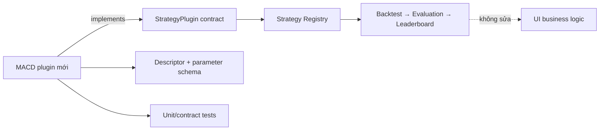

# 4. Thêm strategy mới sửa ở đâu?

## Trả lời ngắn

Thêm Strategy mới bằng cách tạo implementation/plugin trong `modules/strategies`, khai báo descriptor và parameter schema, viết test rồi đăng ký plugin. Registry tra cứu nó qua cùng `StrategyPlugin` contract. Không sửa Backtester, Evaluator, Leaderboard hay logic UI vì các phần đó chỉ biết contract chung `Strategy → StrategyDecision`.

## Minh họa

## Ví dụ cụ thể

Hiện registry tin cậy đăng ký `MovingAverageCrossoverPlugin`. Muốn thêm MACD, nhóm tạo `MacdStrategy` và `MacdStrategyPlugin`, mô tả các tham số như fast/slow/signal period, thêm vào danh sách contribution và chạy contract/architecture test. Backtester vẫn chỉ gọi Strategy với `StrategyContext` và nhận `BUY`, `SELL` hoặc `HOLD`.

Composite Strategy cũng không cần biết class MACD cụ thể; materializer lấy các Strategy version qua registry rồi Majority Vote kết hợp quyết định.

## Trạng thái và trade-off

**Implemented:** contract, Registry, MA Crossover plugin, parameter validation và Composite Majority Vote. MACD thực tế chưa phải plugin production; nó là phép kiểm chứng thay đổi mục tiêu QA-01. Plugin architecture thêm công việc version/schema/registration nhưng ngăn chuỗi `if/else` lan khắp hệ thống.

## Bằng chứng trong project

- [ADR-0005 — Strategy Plugin Registry](../../adr/0005-strategy-plugin-registry.md)
- [StrategyPlugin contract](../../../modules/strategy-core/src/main/java/com/cryptostrategy/platform/strategy/api/StrategyPlugin.java)
- [DefaultStrategyRegistry](../../../modules/strategy-core/src/main/java/com/cryptostrategy/platform/strategy/internal/registry/DefaultStrategyRegistry.java)
- [StrategyPlugins registration](../../../modules/strategies/src/main/java/com/cryptostrategy/platform/strategies/api/StrategyPlugins.java)
- [MA Crossover implementation](../../../modules/strategies/src/main/java/com/cryptostrategy/platform/strategies/internal/ma/MovingAverageCrossoverStrategy.java)
- [Strategy architecture test](../../../architecture-tests/src/test/java/com/cryptostrategy/platform/architecture/StrategyArchitectureTest.java)

## Nguồn đề bài

Mục 6–14 của [đề đồ án](../../Crypto%20Strategy%20Lab%20%E2%80%93%20%C4%90%E1%BB%93%20%C3%A1n%20cu%E1%BB%91i%20k%E1%BB%B3.pdf) và Architecture Proof/Checklist trong [slide kiến trúc](../../KienTrucDoAn_slide.pdf).
