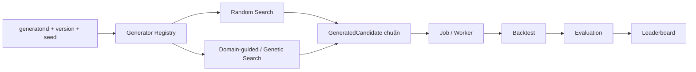

# 5. Đổi Search Algorithm sửa ở đâu?

## Trả lời ngắn

Muốn thay Random Search bằng Domain-guided hoặc Genetic Search, nhóm chỉ cần:

1. Tạo generator mới implement `StrategyGenerator`.
2. Khai báo ID và version của generator.
3. Viết test về tính đúng đắn, deterministic và khả năng thay thế.
4. Đăng ký generator mới qua `SearchModuleFactory`.

Job, Worker, Backtest, Evaluation và Leaderboard không phải sửa vì mọi generator đều sinh cùng `GeneratedCandidate` contract.

## Minh họa



## Contract chung

Mọi thuật toán Search đều triển khai `StrategyGenerator`:

```java
public interface StrategyGenerator {
    GeneratorDescriptor descriptor();
    GenerationOutcome generateNext(GenerationRequest request);
}
```

`descriptor()` cung cấp ID và version. `generateNext()` nhận Search Space, seed, state và generation index rồi trả candidate cùng state kế tiếp.

Bằng chứng: [`StrategyGenerator.java`](../../../modules/search/src/main/java/com/cryptostrategy/platform/search/api/port/in/StrategyGenerator.java), [`GenerationRequest.java`](../../../modules/search/src/main/java/com/cryptostrategy/platform/search/api/model/GenerationRequest.java) và [`GenerationOutcome.java`](../../../modules/search/src/main/java/com/cryptostrategy/platform/search/api/model/GenerationOutcome.java).

## Ví dụ đang có trong project

`RandomStrategyGenerator` là thuật toán hiện tại. Nó có ID `random-search`, version `1.0.0` và dùng seed cùng state đã version hóa để có thể sinh lại đúng candidate.

Bằng chứng: [`RandomStrategyGenerator.java`](../../../modules/search/src/main/java/com/cryptostrategy/platform/search/internal/RandomStrategyGenerator.java) và [`RandomStrategyGeneratorTest.java`](../../../modules/search/src/test/java/com/cryptostrategy/platform/search/internal/RandomStrategyGeneratorTest.java).

Nếu thêm Genetic Search, generator mới có cấu trúc tương ứng:

```java
public final class GeneticStrategyGenerator implements StrategyGenerator {
    public GeneratorDescriptor descriptor() { /* ID và version */ }

    public GenerationOutcome generateNext(GenerationRequest request) {
        // Sinh candidate theo population, mutation và crossover
    }
}
```

Genetic Search hiện là ví dụ mở rộng, chưa phải implementation production trong project.

## Đăng ký và lựa chọn generator

`StrategyGeneratorRegistry` lựa chọn chính xác generator theo cặp `generatorId + generatorVersion` và từ chối đăng ký trùng.

Bằng chứng: [`StrategyGeneratorRegistry.java`](../../../modules/search/src/main/java/com/cryptostrategy/platform/search/internal/StrategyGeneratorRegistry.java) và [`StrategyGeneratorRegistryTest.java`](../../../modules/search/src/test/java/com/cryptostrategy/platform/search/internal/StrategyGeneratorRegistryTest.java).

`SearchModuleFactory` hiện đăng ký `RandomStrategyGenerator`. Generator mới sẽ được truyền vào factory theo cùng contract, không cần sửa Search Coordinator theo từng loại thuật toán.

Bằng chứng: [`SearchModuleFactory.java`](../../../modules/search/src/main/java/com/cryptostrategy/platform/search/api/SearchModuleFactory.java) và [`GeneratorReplaceabilityTest.java`](../../../modules/search/src/test/java/com/cryptostrategy/platform/search/internal/GeneratorReplaceabilityTest.java).

## Vì sao các bước phía sau không phải sửa?

Generator chỉ chịu trách nhiệm đề xuất candidate. Nó không chạy Backtest, tính metric, xếp hạng, ghi database hay publish queue message. Search Coordinator nhận output chuẩn rồi điều phối các bước phía sau.

Vì Random Search và generator mới đều trả `GenerationOutcome` chứa `GeneratedCandidate`, Job và Backtest không cần biết candidate được tạo bằng thuật toán nào.

Bằng chứng: [`GeneratedCandidate.java`](../../../modules/search/src/main/java/com/cryptostrategy/platform/search/api/model/GeneratedCandidate.java), [`SearchGenerationService.java`](../../../modules/search/src/main/java/com/cryptostrategy/platform/search/internal/SearchGenerationService.java) và [ADR-0010 — Strategy Generator Contract](../../adr/0010-strategy-generator-contract.md).

## Khả năng tái lập

Experiment cần lưu `generatorId`, version, seed, Search Space và generator state. Với cùng input và state, generator phải sinh cùng candidate. Điều này giúp kiểm tra và tái lập kết quả Search.

Bằng chứng: [`GeneratorReplaceabilityTest.java`](../../../modules/search/src/test/java/com/cryptostrategy/platform/search/internal/GeneratorReplaceabilityTest.java) và [`CanonicalSearchSpaceTest.java`](../../../modules/search/src/test/java/com/cryptostrategy/platform/search/internal/CanonicalSearchSpaceTest.java).

## Trạng thái hiện tại

- **Đã có:** contract, Registry, Random Search, state versioning và test khả năng thay thế.
- **Chưa có:** Domain-guided và Genetic Search production implementation.

Thiết kế này áp dụng Open–Closed Principle: có thể bổ sung thuật toán Search mới nhưng hạn chế sửa pipeline Backtest–Evaluation–Leaderboard.

## Nguồn đề bài

Mục 15–18 và 23–24 trong [đề đồ án](../../Crypto%20Strategy%20Lab%20%E2%80%93%20%C4%90%E1%BB%93%20%C3%A1n%20cu%E1%BB%91i%20k%E1%BB%B3.pdf); các slide về Strategy Search và checklist slide 39 trong [slide kiến trúc](../../KienTrucDoAn_slide.pdf).
