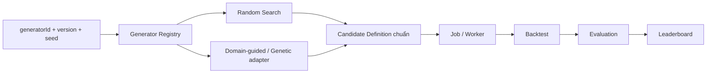

# 5. Đổi search algorithm sửa ở đâu?

## Trả lời ngắn

Chỉ thêm implementation của `StrategyGenerator`, descriptor/registration và test trong capability Search. Mọi generator phải nhận frozen search context và sinh cùng `Candidate Definition` chuẩn. Vì Job, Worker, Backtest, Evaluation và Leaderboard chỉ tiêu thụ Candidate contract nên không phải viết lại khi chuyển Random sang Domain-guided hoặc Genetic Search.

## Minh họa

## Hiểu đơn giản

Generator giống người đề xuất các cấu hình cần thử. Random Search bốc ngẫu nhiên có seed; một generator khác có thể dùng kiến thức domain. Cả hai đều nộp cùng một “phiếu Candidate”, nên dây chuyền phía sau không quan tâm phiếu được tạo bằng cách nào.

Để kết quả tái tạo được, manifest lưu `generatorId`, version, seed, search space và stop condition. Đổi thuật toán là đổi producer, không đổi contract của consumer.

## Trạng thái và trade-off

Boundary được quyết định bởi [ADR-0010](../../adr/0010-strategy-generator-contract.md), và roadmap đặt Search Coordinator ở F-010. Cần dựa vào source/test của F-010 trên branch hiện tại khi tuyên bố generator cụ thể đã Verified; tài liệu này không coi các thuật toán nâng cao trong đề là đã implement. Registry tăng metadata/versioning nhưng giúp thay thuật toán có kiểm soát.

## Bằng chứng trong project

- [ADR-0010 — Strategy Generator contract](../../adr/0010-strategy-generator-contract.md)
- [Search module](../../../modules/search)
- [Search/Queue/Leaderboard flow](../../architecture/data-flows.md)
- [QA-02](../../architecture/quality-attributes.md)
- [Implementation Roadmap — F-010](../../implementation-roadmap.md)

## Nguồn đề bài

Mục 15–18 và 23–24 trong [đề đồ án](../../Crypto%20Strategy%20Lab%20%E2%80%93%20%C4%90%E1%BB%93%20%C3%A1n%20cu%E1%BB%91i%20k%E1%BB%B3.pdf); các slide về Strategy Search và checklist slide 39 trong [slide kiến trúc](../../KienTrucDoAn_slide.pdf).

