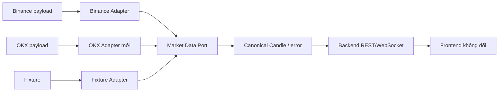

# 6. Provider mới có làm frontend đổi?

## Trả lời ngắn

Không, nếu provider mới có adapter tuân thủ `MarketDataProvider` và ánh xạ dữ liệu sang canonical `Candle`/error của hệ thống. Frontend chỉ gọi REST/WebSocket của Crypto Strategy Lab, không biết JSON, symbol hay error riêng của Binance. Khi đổi sang OKX, phần cần thêm là adapter, configuration và contract test phía backend.

## Minh họa

## Adapter & API làm nhiệm vụ gì?

- **Frontend độc lập Schema:** Đổi symbol/interval/timestamp/OHLCV đặc thù của provider sang kiểu chuẩn (Canonical Candle). Frontend không bao giờ thấy mã lỗi hay cấu trúc JSON của Binance.
- **Realtime Flow & WebSocket:** Cung cấp luồng dữ liệu thời gian thực (stream) rõ ràng, có xử lý tự động reconnect, gap recovery và connection status ngầm phía Backend.
- **Multi-timeframe (Tối đa 4 chart):** Thông qua WebSocket Multiplexing, Frontend có thể mở tối đa 4 chart, mỗi chart đăng ký (subscribe) một timeframe độc lập (ví dụ chart 1 xem 1m, chart 2 xem 15m) trên cùng một kết nối mạng mà không bị xung đột dữ liệu.
- Không để response object hoặc credential của provider thoát khỏi module Market.

Ví dụ Binance có thể dùng `BTCUSDT`, trong khi public contract dùng `BTC/USDT`. OKX có format khác nhưng adapter của OKX chịu trách nhiệm chuyển đổi.

## Trạng thái và trade-off

**Implemented:** Market port, Binance REST/WebSocket transport, mapper, retry/recovery và contract tests. OKX chưa được implement. Canonical model giúp frontend ổn định nhưng có thể không chứa mọi field đặc thù của từng sàn.

## Bằng chứng trong project

- [ADR-0003 — Market Data Provider Adapter](../../adr/0003-market-data-adapter.md)
- [MarketDataProvider](../../../modules/market-data/src/main/java/com/cryptostrategy/platform/marketdata/api/port/out/MarketDataProvider.java)
- [Binance mapper](../../../modules/market-data/src/main/java/com/cryptostrategy/platform/marketdata/internal/provider/binance/BinanceCandleMapper.java)
- [Realtime recovery](../../../modules/market-data/src/main/java/com/cryptostrategy/platform/marketdata/internal/realtime/RealtimeRecoveryCoordinator.java)
- [Binance mapper test](../../../modules/market-data/src/test/java/com/cryptostrategy/platform/marketdata/internal/provider/binance/BinanceCandleMapperTest.java)

## Nguồn đề bài

Mục 4–5 và 32 trong [đề đồ án](../../Crypto%20Strategy%20Lab%20%E2%80%93%20%C4%90%E1%BB%93%20%C3%A1n%20cu%E1%BB%91i%20k%E1%BB%B3.pdf); ATAM scenario đổi provider và checklist slide 39 trong [slide kiến trúc](../../KienTrucDoAn_slide.pdf).

