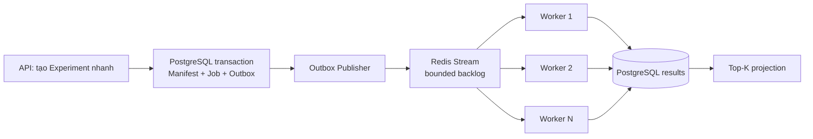

# 7. 100.000 backtests scale thế nào?

## Trả lời ngắn

Không chạy 100.000 Backtest trực tiếp trong HTTP request vì sẽ gây timeout và cạn kiệt RAM. Hệ thống xử lý qua 4 bước:

1. API chỉ đóng băng cấu hình (Experiment), lưu vào bảng Outbox rồi trả về ngay cho user.
2. `OutboxPublisherEngine` quét database và đẩy Message (Job) vào Queue (Redis Stream).
3. Nhiều Worker độc lập đọc Job từ Queue qua cơ chế Consumer Group để chia tải.
4. Worker đọc dữ liệu thị trường theo từng lô nhỏ (Batching), chạy xong ghi kết quả xuống DB.

Kiến trúc này cho phép scale ngang bằng cách tăng số Worker. Tuy nhiên, không thể tăng vô hạn vì PostgreSQL connection pool, Redis, network và Dataset I/O có thể trở thành bottleneck.

## Minh họa



## Các lớp bảo vệ & Code chứng minh

### 1. Asynchronous (Queue/Worker Pattern)
Thay vì bắt API xử lý và bắt user chờ, hệ thống đóng gói công việc và đẩy vào hàng đợi. Các Worker sẽ thay nhau vào lấy việc.

```java
// Worker publish job vào hàng đợi (Redis Stream)
public int publishPendingOutboxBatch() {
    List<OutboxRecord> batch = outboxPort.listUnpublishedBatch(batchSize);
    for (OutboxRecord record : batch) {
        // Đẩy job backtest vào Redis Stream
        streamPublisher.publish(streamKey, record.messageId(), record.payload(), ...);
        outboxPort.recordPublishSuccess(record.outboxEventId(), Instant.now());
    }
}
```
Bằng chứng: [`OutboxPublisherEngine.java`](../../../apps/worker/src/main/java/com/cryptostrategy/platform/worker/engine/OutboxPublisherEngine.java).

### 2. Batching (Chống tràn RAM)
Nếu 1 chiến lược chạy trên 10 năm dữ liệu (hàng triệu cây nến), việc nạp tất cả vào RAM sẽ làm sập app ngay lập tức. Worker chỉ đọc dữ liệu theo từng lô (Batch).

```java
@FunctionalInterface
public interface DatasetCandleReader {
    // Đọc Candle theo từng gói (batchSize) thay vì đọc toàn bộ
    CandleBatch readCandles(DatasetVersionId datasetId, int fromSequence, int batchSize);
}
```
Bằng chứng: [`DatasetCandleReader.java`](../../../modules/market-data/src/main/java/com/cryptostrategy/platform/marketdata/api/port/out/DatasetCandleReader.java).

### 3. Top-K Projection (Tối ưu truy vấn bảng xếp hạng)

Leaderboard tạo một revision chỉ chứa số lượng kết quả tốt nhất do Experiment cấu hình bằng `topK`, thay vì trả toàn bộ Candidate cho UI. `TopKProjector` lọc kết quả hợp lệ, sắp xếp ổn định rồi lấy đúng giới hạn này. `topK` không cố định là 50; public API hiện cho phép cấu hình từ 1 đến 100.

Bằng chứng: [`TopKProjector.java`](../../../modules/leaderboard/src/main/java/com/cryptostrategy/platform/leaderboard/internal/TopKProjector.java) và [OpenAPI contract](../../api/openapi.yaml).

### 4. Recovery và quan sát tiến trình

Job và Attempt lưu trạng thái cùng thời điểm bắt đầu/kết thúc trong PostgreSQL. Nếu một Attempt ở trạng thái chạy quá lâu, Recovery Sweeper đánh dấu nó stale và áp dụng policy retry. Lỗi không thể xử lý được mới đi Dead Letter Stream; không nên hiểu mọi Job chạy lâu đều bị tự động đưa vào DLQ.

Bằng chứng: [`RecoverySweeperEngine.java`](../../../apps/worker/src/main/java/com/cryptostrategy/platform/worker/engine/RecoverySweeperEngine.java) và [`StaleAttemptAndRecoveryIntegrationTest.java`](../../../apps/worker/src/test/java/com/cryptostrategy/platform/worker/integration/StaleAttemptAndRecoveryIntegrationTest.java).

## Vì sao UI/Frontend không bị chậm?

Luồng xử lý nặng được đẩy sang process `apps/worker`. `apps/api` ghi nhận yêu cầu và trả về `HTTP 202 Accepted` mà không chờ toàn bộ Search hoàn tất. Nhờ vậy Backtest không giữ HTTP request; frontend theo dõi snapshot/progress qua REST và WebSocket.

## Trạng thái hiện tại

- **Đã có:** Worker runtime, Redis Stream adapters, Outbox publisher, recovery/dedup tests và batch Dataset reader.
- **Chưa được chứng minh bằng benchmark:** 100.000 Backtests và mức tăng throughput khi chạy 1 so với 3 Worker. Đây là mục tiêu kiến trúc, không phải số liệu đã đạt.

## Cách nói khi trình bày

> API không tự chạy 100.000 Backtests. Nó lưu cấu hình và Job rồi trả về ngay. Redis Stream chia Job cho nhiều Worker; mỗi Worker đọc dữ liệu theo batch, chạy và lưu kết quả. Có thể tăng Worker để tăng tốc, nhưng nhóm vẫn phải benchmark vì database hoặc I/O có thể trở thành nút thắt.

## Nguồn đề bài

Mục 15–24 của [đề đồ án](../../Crypto%20Strategy%20Lab%20%E2%80%93%20%C4%90%E1%BB%93%20%C3%A1n%20cu%E1%BB%91i%20k%E1%BB%B3.pdf); slide 17–21, ATAM scenario C và checklist slide 39 trong [slide kiến trúc](../../KienTrucDoAn_slide.pdf).
