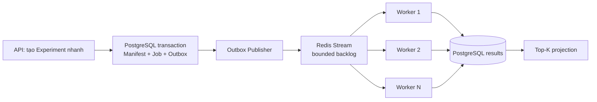

# 7. 100.000 backtests scale thế nào?

## Trả lời ngắn

Không chạy 100.000 Backtest trong HTTP request và không nạp tất cả vào RAM. API chỉ đóng băng Experiment, tạo Job/Outbox rồi trả ID. Search sinh Candidate theo batch có giới hạn; Redis Stream phân phối Job cho consumer group gồm nhiều Worker. Mỗi Worker đọc Candle theo batch, lưu kết quả idempotent vào PostgreSQL; Leaderboard chỉ duy trì Top-K. Khi tải tăng có thể scale ngang Worker, nhưng database/connection pool vẫn là bottleneck phải đo.

## Minh họa

## Các lớp bảo vệ

1. **Asynchronous:** request không đợi toàn bộ search/backtest.
2. **Bounded work:** giới hạn candidate đang chạy và backlog để tránh tràn RAM/DB.
3. **Consumer group:** nhiều Worker chia Job, một Job lỗi có thể reclaim.
4. **Batching:** Dataset được đọc bằng `CandleBatch`, không materialize toàn bộ.
5. **Idempotency:** delivery lặp không tạo kết quả nghiệp vụ lặp.
6. **Top-K projection:** màn hình không phải sort toàn bộ kết quả mỗi lần.

## Trạng thái và trade-off

**Implemented:** Worker runtime, Redis Stream adapters, Outbox publisher, recovery/dedup tests và batch Dataset reader. **Chưa Verified:** 100.000 Backtest thực tế và mục tiêu QA-05 “3 Worker đạt ít nhất 2× một Worker”. Scale ngang tăng throughput nhưng gây áp lực lên PostgreSQL, network và connection pool; cần benchmark để tìm bottleneck thật.

## Bằng chứng trong project

- [ADR-0006 — Queue và Worker](../../adr/0006-queue-worker-backtesting.md)
- [Search flow](../../architecture/data-flows.md)
- [Worker application](../../../apps/worker/src/main/java/com/cryptostrategy/platform/worker/WorkerApplication.java)
- [Outbox publisher](../../../apps/worker/src/main/java/com/cryptostrategy/platform/worker/engine/OutboxPublisherEngine.java)
- [Backtest pipeline integration test](../../../apps/worker/src/test/java/com/cryptostrategy/platform/worker/integration/BacktestExecutionPipelineIntegrationTest.java)
- [DatasetCandleReader](../../../modules/market-data/src/main/java/com/cryptostrategy/platform/marketdata/api/port/out/DatasetCandleReader.java)

## Nguồn đề bài

Mục 15–24 của [đề đồ án](../../Crypto%20Strategy%20Lab%20%E2%80%93%20%C4%90%E1%BB%93%20%C3%A1n%20cu%E1%BB%91i%20k%E1%BB%B3.pdf); slide 17–21, ATAM scenario C và checklist slide 39 trong [slide kiến trúc](../../KienTrucDoAn_slide.pdf).

