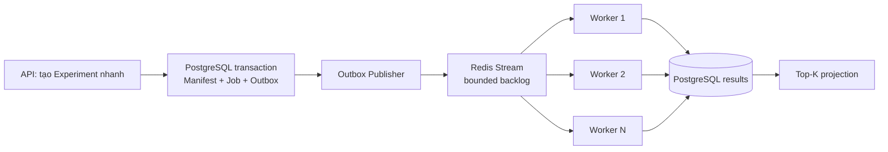

# 7. 100.000 backtests scale thế nào?

## Trả lời ngắn

Không chạy 100.000 Backtest trực tiếp trong HTTP request vì sẽ gây timeout và cạn kiệt RAM. Hệ thống xử lý qua 4 bước:

1. API chỉ đóng băng cấu hình (Experiment), lưu vào bảng Outbox rồi trả về ngay cho user.
2. `OutboxPublisherEngine` quét database và đẩy Message (Job) vào Queue (Redis Stream).
3. Nhiều Worker độc lập đọc Job từ Queue qua cơ chế Consumer Group để chia tải.
4. Worker đọc dữ liệu thị trường theo từng lô nhỏ (Batching), chạy xong ghi kết quả xuống DB.

Kiến trúc này cho phép scale ngang (cắm thêm bao nhiêu máy Worker tùy thích) khi số lượng backtest lên tới hàng trăm ngàn.

## Minh họa



## Các lớp bảo vệ & Code chứng minh

### 1. Asynchronous (Queue/Worker Pattern)
Thay vì bắt API xử lý và bắt user chờ, hệ thống đóng gói công việc và đẩy vào hàng đợi. Các Worker sẽ thay nhau vào lấy việc.

```java
// Worker publish job vào hàng đợi (Redis Stream)
public int publishPendingOutboxBatch() {
    List<OutboxRecord> batch = outboxPort.listUnpublishedBatch(batchSize);
    for (OutboxRecord record : batch) {
        // Đẩy job backtest vào Redis Stream
        streamPublisher.publish(streamKey, record.messageId(), record.payload(), ...);
        outboxPort.recordPublishSuccess(record.outboxEventId(), Instant.now());
    }
}
```
Bằng chứng: [`OutboxPublisherEngine.java`](../../../apps/worker/src/main/java/com/cryptostrategy/platform/worker/engine/OutboxPublisherEngine.java).

### 2. Batching (Chống tràn RAM)
Nếu 1 chiến lược chạy trên 10 năm dữ liệu (hàng triệu cây nến), việc nạp tất cả vào RAM sẽ làm sập app ngay lập tức. Worker chỉ đọc dữ liệu theo từng lô (Batch).

```java
@FunctionalInterface
public interface DatasetCandleReader {
    // Đọc Candle theo từng gói (batchSize) thay vì đọc toàn bộ
    CandleBatch readCandles(DatasetVersionId datasetId, int fromSequence, int batchSize);
}
```
Bằng chứng: [`DatasetCandleReader.java`](../../../modules/market-data/src/main/java/com/cryptostrategy/platform/marketdata/api/port/out/DatasetCandleReader.java).

### 3. Top-K Projection (Tối ưu truy vấn bảng xếp hạng)
Sau khi chạy xong 100.000 backtest, hệ thống không `ORDER BY PnL` toàn bộ 100.000 dòng mỗi khi user f5 màn hình Leaderboard (rất chậm). Cơ sở dữ liệu sử dụng bảng phụ chỉ lưu 50 kết quả tốt nhất (Top-K) để render cực nhanh.

### 4. Đo lường thời gian thực thi (Metrics & Timeout)
Mỗi Backtest Job đều được bấm giờ (ghi nhận `started_at` và `completed_at` hoặc dùng Micrometer/StopWatch). Việc này giúp hệ thống:
- Biết được trung bình 1 candidate chạy mất bao lâu để dự đoán thời gian hoàn thành 100,000 backtest.
- Tự động huỷ (chuyển sang Dead Letter Queue) các Job bị treo (vượt quá `JOB_EXECUTION_TIMEOUT`) để không làm kẹt Worker.

## Vì sao UI/Frontend không bị chậm?

Luồng xử lý nặng (chạy Backtest) đã bị đẩy ra một Process hoàn toàn riêng biệt là `apps/worker`. Process phục vụ API (`apps/api`) chỉ làm nhiệm vụ ghi nhận yêu cầu và trả về `HTTP 202 Accepted`. Nhờ tách biệt này, Frontend sẽ không bao giờ bị đứng/lag. User sẽ thấy tiến trình chạy tăng dần 1% -> 100% qua cơ chế Polling hoặc WebSocket.

## Trạng thái hiện tại

- **Đã có:** Worker runtime, Redis Stream adapters, Outbox publisher, recovery/dedup tests và batch Dataset reader.
- Thiết kế áp dụng hoàn hảo mẫu kiến trúc **Event-Driven & Queue-Worker**. Scale ngang tăng throughput rất tốt, chỉ cần lưu ý connection pool của PostgreSQL khi cắm quá nhiều Worker.

## Nguồn đề bài

Mục 15–24 của [đề đồ án](../../Crypto%20Strategy%20Lab%20%E2%80%93%20%C4%90%E1%BB%93%20%C3%A1n%20cu%E1%BB%91i%20k%E1%BB%B3.pdf); slide 17–21, ATAM scenario C và checklist slide 39 trong [slide kiến trúc](../../KienTrucDoAn_slide.pdf).

