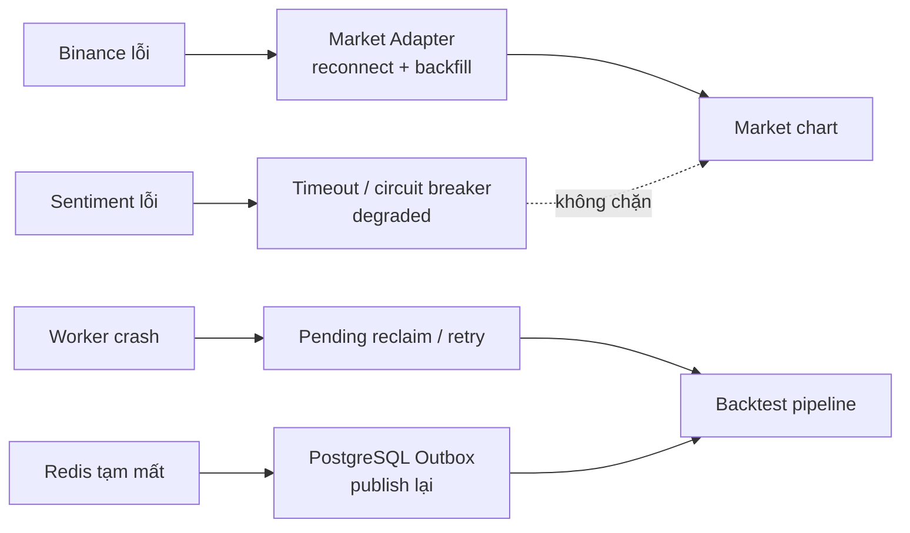

# 8. Service lỗi có lan failure không?

## Trả lời ngắn

Kiến trúc cố gắng **khoanh lỗi theo capability/runtime**. Sentiment là service Python riêng: timeout/circuit breaker làm News chuyển degraded nhưng Market chart và technical Backtest không phụ thuộc nó. Binance lỗi được Market adapter xử lý reconnect/backfill. Worker crash để lại trạng thái durable và pending message cho recovery. Redis mất tạm không làm mất Job vì PostgreSQL và Outbox là source of truth.

## Minh họa

## Không có nghĩa là “không bao giờ ảnh hưởng”

Shared API, database và hạ tầng mạng vẫn là điểm chung. Isolation ở đây nghĩa là lỗi chức năng phụ không tự động làm hỏng capability độc lập, đồng thời có timeout, trạng thái degraded và cơ chế phục hồi rõ ràng.

| Lỗi | Phản ứng dự kiến |
| --- | --- |
| Sentiment timeout/down | Retry giới hạn, mở circuit, News pending/retryable; chart tiếp tục |
| Binance disconnect | Báo reconnecting, backoff, backfill gap, deduplicate |
| Worker crash | Attempt/job durable; sweeper reclaim công việc stale |
| Redis outage | Outbox vẫn còn trong PostgreSQL và publish lại khi Redis phục hồi |

## Trạng thái và trade-off

Các cơ chế và test đơn vị/tích hợp đã tồn tại. Mục tiêu UI báo degraded ≤5 giây và demo kill-service end-to-end vẫn cần phép đo trên môi trường chạy thật. Tách service tăng network failure và deployment complexity, nhưng cô lập Python/model khỏi Java market flow.

## Bằng chứng trong project

- [ADR-0008 — Sentiment boundary](../../adr/0008-sentiment-service-boundary.md)
- [Sentiment resilience test](../../../apps/worker/src/test/java/com/cryptostrategy/platform/worker/news/sentiment/SentimentClientResilienceTest.java)
- [News analysis coordinator test](../../../apps/worker/src/test/java/com/cryptostrategy/platform/worker/news/analysis/NewsAnalysisCoordinatorTest.java)
- [Realtime recovery test](../../../modules/market-data/src/test/java/com/cryptostrategy/platform/marketdata/internal/realtime/RealtimeRecoveryCoordinatorTest.java)
- [Stale attempt recovery test](../../../apps/worker/src/test/java/com/cryptostrategy/platform/worker/integration/StaleAttemptAndRecoveryIntegrationTest.java)

## Nguồn đề bài

Mục 27–30, 32 và 40 trong [đề đồ án](../../Crypto%20Strategy%20Lab%20%E2%80%93%20%C4%90%E1%BB%93%20%C3%A1n%20cu%E1%BB%91i%20k%E1%BB%B3.pdf); ATAM scenarios B/D và checklist slide 39 trong [slide kiến trúc](../../KienTrucDoAn_slide.pdf).

