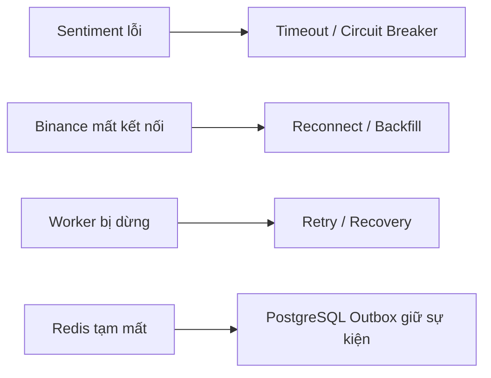

# 8. Một service bị lỗi có làm hỏng toàn hệ thống không?

## Trả lời ngắn

Không phải mọi lỗi đều làm hỏng toàn hệ thống. Các chức năng chính được tách thành những module hoặc runtime riêng. Khi một thành phần lỗi, hệ thống giới hạn ảnh hưởng trong phần đó và dùng timeout, retry hoặc dữ liệu đã lưu để phục hồi.

Ví dụ, Sentiment Service bị lỗi thì việc phân tích cảm xúc tạm dừng, nhưng Market chart và Technical Backtest vẫn hoạt động vì không phụ thuộc vào Sentiment.

## Minh họa

## Sentiment Service bị lỗi

Worker gọi Sentiment Service với timeout và Circuit Breaker:

- **Timeout:** không chờ service lỗi vô thời hạn.
- **Circuit Breaker:** nếu lỗi liên tục, hệ thống tạm ngừng gửi thêm request để tránh lỗi lan rộng.
- **Concurrency limit:** giới hạn số request Sentiment chạy cùng lúc.

Kết quả phân tích News có thể chờ hoặc retry sau. Market Data và Technical Backtest không gọi Sentiment Service nên vẫn tiếp tục hoạt động.

Bằng chứng: [`SentimentClientGuard.java`](../../../apps/worker/src/main/java/com/cryptostrategy/platform/worker/news/sentiment/SentimentClientGuard.java), [`NewsWorkerConfiguration.java`](../../../apps/worker/src/main/java/com/cryptostrategy/platform/worker/config/NewsWorkerConfiguration.java) và [`SentimentClientResilienceTest.java`](../../../apps/worker/src/test/java/com/cryptostrategy/platform/worker/news/sentiment/SentimentClientResilienceTest.java).

## Binance bị mất kết nối

Nếu request Binance lỗi tạm thời hoặc bị rate limit, Market Data Adapter retry có giới hạn. Nếu WebSocket bị ngắt, hệ thống kết nối lại và lấy bù dữ liệu bị thiếu thay vì làm lỗi các module khác.

Bằng chứng: [`BinanceRetryPolicy.java`](../../../modules/market-data/src/main/java/com/cryptostrategy/platform/marketdata/internal/provider/binance/BinanceRetryPolicy.java), [`BinanceRetryPolicyTest.java`](../../../modules/market-data/src/test/java/com/cryptostrategy/platform/marketdata/internal/provider/binance/BinanceRetryPolicyTest.java) và [`RealtimeRecoveryCoordinatorTest.java`](../../../modules/market-data/src/test/java/com/cryptostrategy/platform/marketdata/internal/realtime/RealtimeRecoveryCoordinatorTest.java).

## Worker bị dừng giữa lúc chạy

Trạng thái Job và Execution Attempt được lưu bền vững. Khi Worker bị dừng, Recovery Sweeper tìm những công việc bị bỏ dở hoặc đến thời điểm retry rồi đưa chúng trở lại hàng đợi.

Vì vậy, việc Worker bị restart không đồng nghĩa với mất toàn bộ Job.

Bằng chứng: [`RecoverySweeperEngine.java`](../../../apps/worker/src/main/java/com/cryptostrategy/platform/worker/engine/RecoverySweeperEngine.java) và [`StaleAttemptAndRecoveryIntegrationTest.java`](../../../apps/worker/src/test/java/com/cryptostrategy/platform/worker/integration/StaleAttemptAndRecoveryIntegrationTest.java).

## Redis tạm thời bị lỗi

Redis được dùng để chuyển message, nhưng PostgreSQL mới lưu trạng thái nghiệp vụ chính. Sự kiện cần gửi được ghi vào Outbox cùng transaction với dữ liệu nghiệp vụ. Nếu Redis chưa nhận được message, Outbox vẫn giữ sự kiện để publisher gửi lại sau.

Trong lúc Redis bị lỗi, Job có thể bị chậm; nhưng yêu cầu đã ghi thành công vào PostgreSQL không bị mất chỉ vì Redis tạm thời không hoạt động.

Bằng chứng: [`JobStore.java`](../../../modules/experiment/src/main/java/com/cryptostrategy/platform/experiment/api/port/out/JobStore.java), [`JdbcJobStore.java`](../../../modules/persistence/src/main/java/com/cryptostrategy/platform/persistence/internal/experiment/JdbcJobStore.java) và [ADR-0006 — Queue và Worker](../../adr/0006-queue-worker-backtesting.md).

## Retry có giới hạn

Hệ thống không retry mãi mãi. Lỗi tạm thời như mất mạng có thể được thử lại; lỗi logic vĩnh viễn thì dừng. Message không thể xử lý được đưa vào Dead Letter Stream để kiểm tra thay vì chặn các message khác.

Bằng chứng: [`FailureClassification.java`](../../../modules/experiment/src/main/java/com/cryptostrategy/platform/experiment/api/job/FailureClassification.java), [`DeadLetterPublisher.java`](../../../apps/worker/src/main/java/com/cryptostrategy/platform/worker/infra/redis/DeadLetterPublisher.java) và [`DeadLetterPublisherTest.java`](../../../apps/worker/src/test/java/com/cryptostrategy/platform/worker/infra/redis/DeadLetterPublisherTest.java).

## Giới hạn của Failure Isolation

Failure isolation không có nghĩa là hệ thống không bao giờ bị ảnh hưởng. Nếu PostgreSQL, API hoặc toàn bộ hạ tầng mạng bị lỗi thì nhiều chức năng vẫn có thể dừng.

Ý nghĩa của isolation là một chức năng phụ bị lỗi không tự động kéo sập các chức năng độc lập, đồng thời hệ thống biết giới hạn thời gian chờ, lưu trạng thái và phục hồi công việc.

## Trạng thái hiện tại

- **Đã có:** timeout và Circuit Breaker cho Sentiment, retry/recovery cho Market Data và Worker, Outbox, phân loại lỗi và Dead Letter Stream.
- **Cần đo trên môi trường chạy thật:** thời gian UI hiển thị trạng thái degraded và bài thử tắt service end-to-end.

Việc tách service làm tăng độ phức tạp khi triển khai và giám sát, nhưng giúp lỗi của Python/model không lan trực tiếp sang luồng Market Data và Backtest. Quyết định này được ghi tại [ADR-0008 — Sentiment Service Boundary](../../adr/0008-sentiment-service-boundary.md).

## Nguồn đề bài

Mục 27–30, 32 và 40 trong [đề đồ án](../../Crypto%20Strategy%20Lab%20%E2%80%93%20%C4%90%E1%BB%93%20%C3%A1n%20cu%E1%BB%91i%20k%E1%BB%B3.pdf); ATAM scenarios B/D và checklist slide 39 trong [slide kiến trúc](../../KienTrucDoAn_slide.pdf).
