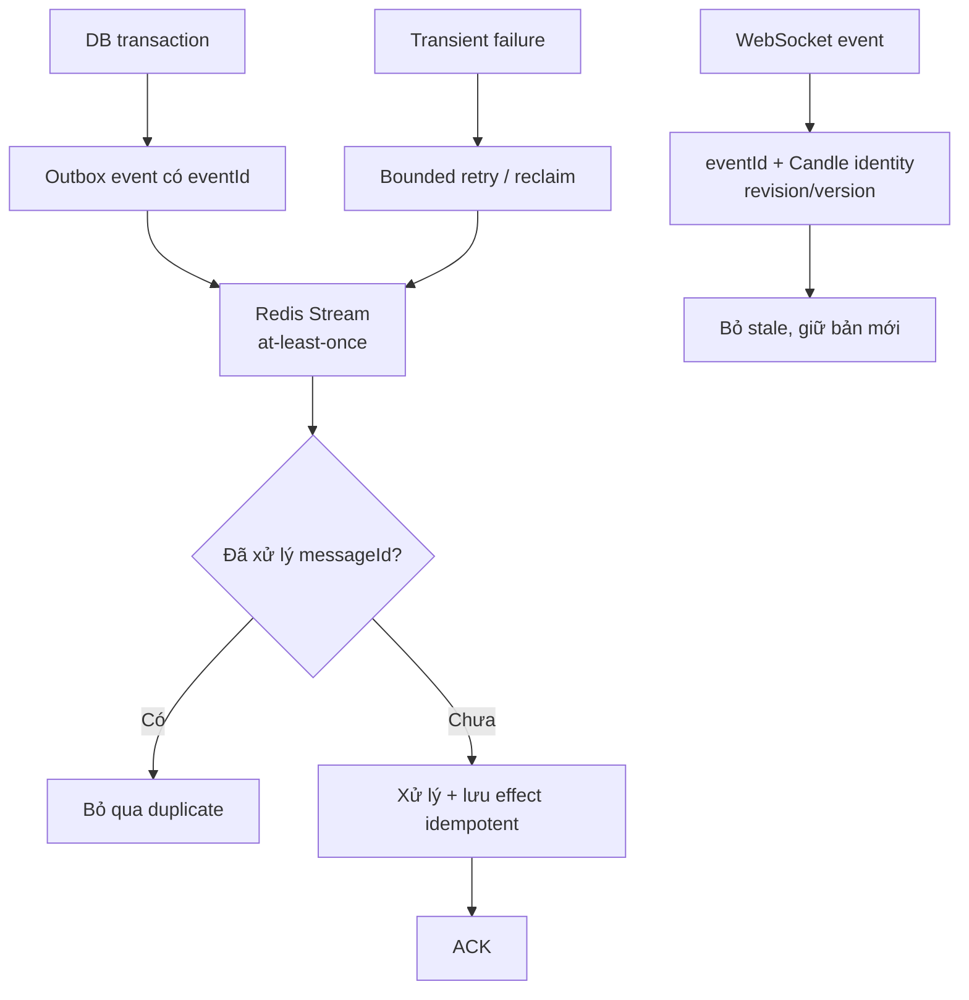

# 9. Duplicate/retry/event order xử lý thế nào?

## Trả lời ngắn

Hệ thống dùng delivery **at-least-once**, nên chấp nhận message có thể đến lặp và chống effect lặp bằng idempotency. Outbox gắn `eventId`; Worker kiểm tra message đã xử lý và persistence có unique/fingerprint để trả aggregate canonical. Lỗi tạm retry có giới hạn, Worker chết thì reclaim pending; lỗi vĩnh viễn đi dead letter. Với WebSocket, frontend dùng `eventId`, Candle identity và Leaderboard revision để bỏ duplicate hoặc bản cũ — không giả định exactly-once.

## Minh họa

## Ba vấn đề khác nhau

- **Duplicate:** cùng event/message đến nhiều lần. Kiểm tra `messageId`, idempotency key và unique business fingerprint.
- **Retry:** chỉ lỗi retryable được thử lại với giới hạn/backoff; không retry vô hạn lỗi logic.
- **Out-of-order:** message mới/cũ đến sai thứ tự. Candle so identity + event time/closed; Leaderboard so revision; frontend không áp dụng revision thấp hơn.

Transactional Outbox giải quyết khoảng trống “DB đã commit nhưng chưa gửi queue”: dữ liệu nghiệp vụ và outbox được ghi cùng transaction, publisher gửi lại sau. Nó không tạo exactly-once; consumer vẫn phải idempotent.

## Trạng thái và trade-off

**Implemented:** Outbox, Redis consumer/publisher, processed-message guard, recovery/dead-letter tests và WebSocket revision/snapshot handling. Hiệu lực end-to-end còn phụ thuộc cấu hình retention, timeout và môi trường. At-least-once đơn giản và bền hơn distributed exactly-once, đổi lại mọi consumer phải thiết kế idempotent.

## Bằng chứng trong project

- [ADR-0006 — Queue/Worker](../../adr/0006-queue-worker-backtesting.md)
- [ADR-0004 — WebSocket realtime](../../adr/0004-websocket-realtime.md)
- [Dual-layer idempotency guard](../../../apps/worker/src/main/java/com/cryptostrategy/platform/worker/consumer/DualLayerIdempotencyGuard.java)
- [Dual-layer dedup integration test](../../../apps/worker/src/test/java/com/cryptostrategy/platform/worker/integration/DualLayerDedupIntegrationTest.java)
- [Outbox/Redis integration test](../../../apps/worker/src/test/java/com/cryptostrategy/platform/worker/integration/OutboxRedisPublishingIntegrationTest.java)
- [Snapshot recovery test](../../../apps/api/src/test/java/com/cryptostrategy/platform/api/realtime/SnapshotRecoveryTest.java)
- [WebSocket event contract](../../api/websocket-events.md)

## Nguồn đề bài

Mục 23–24, 32 và 34 trong [đề đồ án](../../Crypto%20Strategy%20Lab%20%E2%80%93%20%C4%90%E1%BB%93%20%C3%A1n%20cu%E1%BB%91i%20k%E1%BB%B3.pdf); các slide reliability/recovery và checklist slide 39 trong [slide kiến trúc](../../KienTrucDoAn_slide.pdf).

