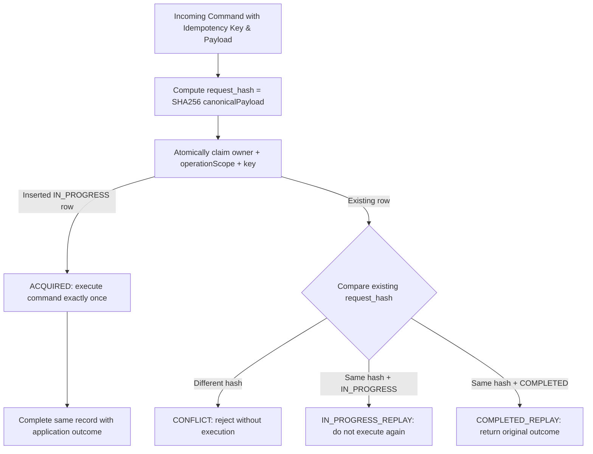

# Contract & Event Schemas: Idempotency & Transactional Outbox

**Feature:** F-005 Experiment Persistence and Ownership  
**Status:** Canonical Design Contract  
**Date:** 2026-08-30  

This document specifies the exact schemas and payload contracts for F-005 Transactional Outbox events and Idempotency key evaluation.

---

## 1. Outbox Event Payloads

F-005 produces Outbox rows for 6 distinct cross-boundary lifecycle dispatch and cancellation transitions. All events are written to `platform.outbox_event`.

### 1.1. `ExperimentQueued` Event
- **Event Type**: `EXPERIMENT_QUEUED`
- **Aggregate Type**: `EXPERIMENT`
- **Trigger**: Experiment transitions `CREATED → QUEUED` (Manifest frozen)
- **Payload Schema**:
```json
{
  "eventId": "01J00000000000000000000001",
  "eventType": "EXPERIMENT_QUEUED",
  "eventVersion": "1.0",
  "occurredAt": "2026-08-30T10:00:00Z",
  "ownerUserId": "10000000-0000-4000-8000-000000000001",
  "experimentId": "60000000000000000000000001",
  "experimentFingerprint": "sha256:abc123...",
  "datasetVersionId": "50000000000000000000000005",
  "strategyKind": "SINGLE",
  "searchConfig": {
    "algorithm": "random-search",
    "seed": 20260830,
    "maxCandidates": 100,
    "topK": 10
  }
}
```

---

### 1.2. `ExperimentStopRequested` Event
- **Event Type**: `EXPERIMENT_STOP_REQUESTED`
- **Aggregate Type**: `EXPERIMENT`
- **Trigger**: Experiment transitions `RUNNING → STOP_REQUESTED`
- **Payload Schema**:
```json
{
  "eventId": "01J00000000000000000000002",
  "eventType": "EXPERIMENT_STOP_REQUESTED",
  "eventVersion": "1.0",
  "occurredAt": "2026-08-30T10:05:00Z",
  "ownerUserId": "10000000-0000-4000-8000-000000000001",
  "experimentId": "60000000000000000000000001",
  "reason": "USER_STOP_REQUEST"
}
```

---

### 1.3. `JobQueued` Event (New Backtest Job or Retry Requeue)
- **Event Type**: `JOB_QUEUED`
- **Aggregate Type**: `JOB`
- **Trigger**: Backtest Job created in `QUEUED` OR Job transitions `RETRY_SCHEDULED → QUEUED`
- **Payload Schema**:
```json
{
  "eventId": "01J00000000000000000000003",
  "eventType": "JOB_QUEUED",
  "eventVersion": "1.0",
  "occurredAt": "2026-08-30T10:01:00Z",
  "correlationId": "70000000000000000000000011",
  "ownerUserId": "10000000-0000-4000-8000-000000000001",
  "experimentId": "60000000000000000000000001",
  "jobId": "70000000000000000000000002",
  "candidateId": "60000000000000000000000003",
  "jobType": "BACKTEST",
  "isRetry": false
}
```

---

### 1.4. `JobCancelRequested` Event
- **Event Type**: `JOB_CANCEL_REQUESTED`
- **Aggregate Type**: `JOB`
- **Trigger**: Job transitions `RUNNING → CANCEL_REQUESTED`
- **Payload Schema**:
```json
{
  "eventId": "01J00000000000000000000004",
  "eventType": "JOB_CANCEL_REQUESTED",
  "eventVersion": "1.0",
  "occurredAt": "2026-08-30T10:05:10Z",
  "correlationId": "70000000000000000000000011",
  "ownerUserId": "10000000-0000-4000-8000-000000000001",
  "experimentId": "60000000000000000000000001",
  "jobId": "70000000000000000000000002",
  "candidateId": "60000000000000000000000003"
}
```

---

### 1.5. `JobCancelled` Event
- **Event Type**: `JOB_CANCELLED`
- **Aggregate Type**: `JOB`
- **Trigger**: Job transitions `QUEUED → CANCELLED`
- **Payload Schema**:
```json
{
  "eventId": "01J00000000000000000000005",
  "eventType": "JOB_CANCELLED",
  "eventVersion": "1.0",
  "occurredAt": "2026-08-30T10:05:15Z",
  "correlationId": "70000000000000000000000011",
  "ownerUserId": "10000000-0000-4000-8000-000000000001",
  "experimentId": "60000000000000000000000001",
  "jobId": "70000000000000000000000002",
  "candidateId": "60000000000000000000000003"
}
```

---


### 1.6. Cancellation While Waiting for Retry

`Job RETRY_SCHEDULED → CANCELLED` is a durable local state transition in F-005 but does **not** produce an Outbox event. The Job has not yet become dispatch-ready again. F-007 retry scheduling must re-read/validate durable Job state before attempting `RETRY_SCHEDULED → QUEUED`, so a cancelled Job is never redispatched.

---

## 2. Idempotency Evaluation Logic

The first claim MUST be atomic; a separate `check()` followed later by an insert is not sufficient under concurrency.



Required persistence semantics:

- `(owner_user_id, operation_scope, idempotency_key)` uniquely identifies one logical request.
- Exactly one concurrent first caller can acquire execution.
- Same key + same hash never executes a second time.
- Same key + different hash is always an application-layer idempotency conflict.
- The persisted record has an explicit lifecycle (`IN_PROGRESS`, `COMPLETED`); completion data is nullable while `IN_PROGRESS`.
- HTTP status mapping is outside F-005; persisted outcome metadata is application-level.

