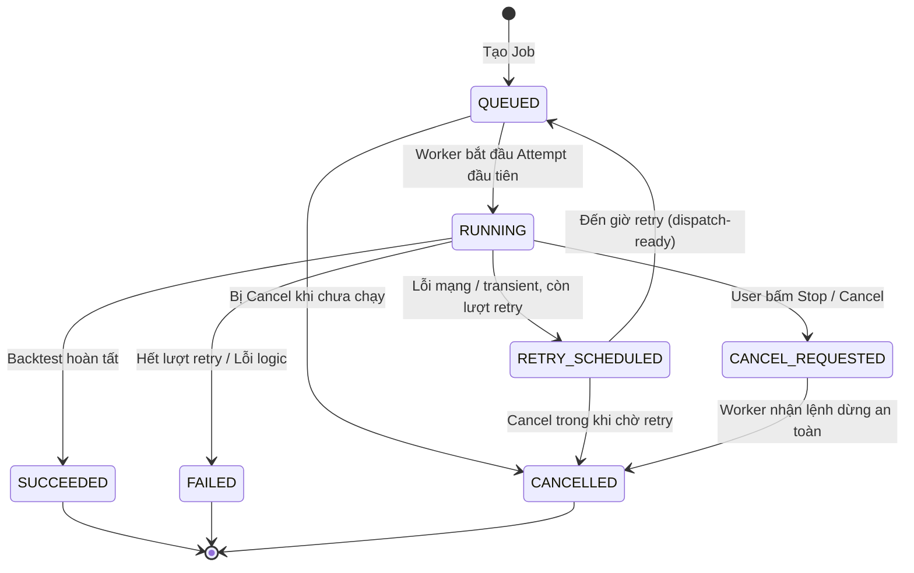
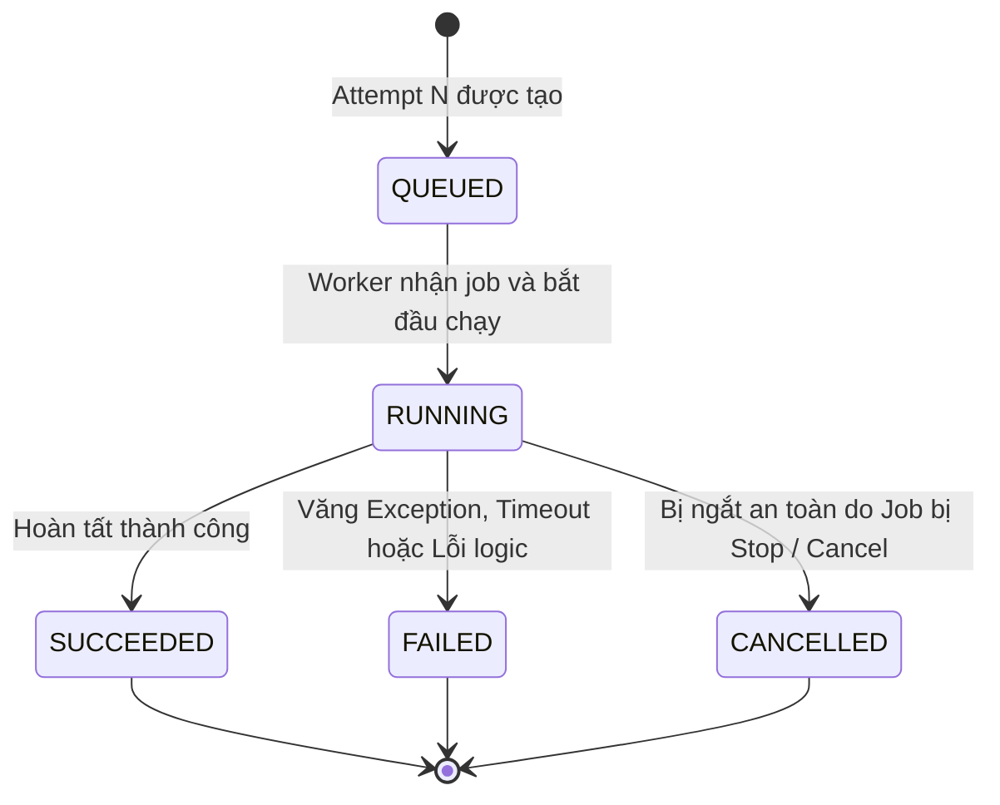

# Contract & State Machine: Candidate → Job → Execution Attempt

**Feature:** F-005 Experiment Persistence and Ownership  
**Owner:** Văn Minh (Domain Contract), Tiến (Integration & Infrastructure)  
**Date:** 2026-08-30  
**Status:** Reconciled with F-005 Specification  

Tài liệu này định nghĩa rõ ranh giới, sơ đồ trạng thái và Interface (Hợp đồng) giữa phần Domain Core (do Văn Minh phụ trách) và phần Infrastructure/Persistence (do Tiến phụ trách) để đảm bảo hai bên có thể làm việc độc lập.

## 1. Ranh giới trách nhiệm (Boundaries)

- **Lớp Domain (Văn Minh):** Chứa các Entity, Aggregate Root (`Job`, `ExecutionAttempt`), định nghĩa trạng thái, quyết định khi nào được phép chuyển trạng thái, logic tính toán số lần Retry (Exponential Backoff), và phân loại lỗi (`FailureClassification`). Lớp Domain **không** biết về Redis, PostgreSQL, hay HikariCP.
- **Lớp Application & Persistence (F-005 / Tiến):** Chứa application service, transaction boundary, PostgreSQL persistence adapter và **Outbox write-side**. F-005 lấy dữ liệu bền vững từ DB -> map thành Domain Model -> gọi transition hợp lệ -> lưu lại atomically. F-005 **không publish Redis/queue**. Redis Streams, Worker orchestration, exception mapping tại Worker, acknowledgement/redelivery và Outbox publisher thuộc F-007.

| Thực thể | Trách nhiệm cốt lõi (Domain) | Trách nhiệm của Tiến (Infrastructure) |
| :--- | :--- | :--- |
| **Candidate** | Cấu hình tham số bất biến. Thuộc về Experiment. | Ánh xạ ID từ Database |
| **Job** | Tổng thể 1 tiến trình (Search/Backtest). Quản lý status, retry policy và tiến trình logic. | Lưu DB, transaction boundary và ghi Outbox row atomically khi spec yêu cầu. |
| **Execution Attempt** | Lưu vết 1 lần Worker cụ thể thử chạy, thời gian thực thi, nguyên nhân lỗi. Trạng thái kết thúc luôn terminal (`SUCCEEDED`, `FAILED`, `CANCELLED`). | F-005 cung cấp persistence/lifecycle transaction; F-007 Worker gọi contract này khi bắt đầu/kết thúc một try. |

---

## 2. Quyết định thiết kế (Design Decisions)

1. **Cancel Propagation Contract:** F-005 bộc lộ durable cancel state qua `isCancelRequested()`/Job status và persistence query. Việc Worker thực sự poll ở safe checkpoint, dừng computation và acknowledgement thuộc F-007. F-005 chỉ đảm bảo transition và dữ liệu cancellation là durable/atomic.
2. **Logic tính toán Retry Delay (Đóng gói trong Domain):** Công thức `next_retry_at = now + (2^attempt * delay)` được đặt trong entity `Job` (`Job.handleFailure()`). Điều này tuân thủ Rich Domain Model, giúp Văn Minh dễ dàng viết Unit Test độc lập hoàn toàn với Spring Boot.
3. **Phân loại lỗi (Transient vs Permanent):** Domain Contract định nghĩa enum `FailureClassification`. F-007 Worker/adapter chịu trách nhiệm map lỗi runtime cụ thể thành classification; F-005 Domain nhận classification đã chuẩn hóa và quyết định Job chuyển `RETRY_SCHEDULED` hay `FAILED`.
4. **Attempt Status là Terminal:** Khi gặp lỗi retryable, Execution Attempt hiện tại được finalize là `FAILED` (kèm `retryable = true`), và chỉ có `Job` là chuyển sang `RETRY_SCHEDULED`. Execution Attempt không mang trạng thái `RETRY_SCHEDULED`. Khi worker bắt đầu lượt chạy tiếp theo, một Execution Attempt mới được tạo với `attempt_no = previous_max + 1`.

---

## 3. Sơ đồ State Machine (Trạng thái)

### 3.1. Job State Machine (Đại diện cho toàn bộ tiến trình)


### 3.2. Execution Attempt State Machine (Đại diện cho 1 lần Worker thử)


---

## 4. Java Contract Interfaces (Domain Layer)

Các file này được định nghĩa tại `modules/experiment/src/main/java/com/cryptostrategy/platform/experiment/api/job/` và `domain/job/`.

### 4.1. Failure Classification Enum
```java
package com.cryptostrategy.platform.experiment.api.job;

public enum FailureClassification {
    TRANSIENT_NETWORK_ERROR,   // Redis timeout, DB connection đứt -> Cho phép Retry
    DATA_UNAVAILABLE_RETRY,    // Dataset đang chuẩn bị -> Cho phép Retry có backoff dài hơn
    PERMANENT_LOGIC_ERROR,     // Sai logic Strategy, Invalid param -> Bỏ qua Retry, FAILED ngay
    WORKER_CRASHED,            // Worker chết ngang / Timeout -> Retry
    UNKNOWN_ERROR
}
```

### 4.2. Job Aggregate Root
```java
package com.cryptostrategy.platform.experiment.api.job;

import com.cryptostrategy.platform.domain.api.identity.UlidIdentifier;
import java.time.Instant;
import java.util.Optional;

public interface Job {
    JobId getId();
    ExperimentId getExperimentId();
    Optional<CandidateId> getCandidateId(); // Empty nếu là Search Job
    JobType getType(); // SEARCH or BACKTEST
    JobStatus getStatus();
    String getCorrelationId();
    int getTotalWork();
    int getCompletedWork();
    int getFailedWork();
    Optional<Instant> getNextRetryAt();
    
    // Polling cho Cancel
    boolean isCancelRequested();
    
    // Core Transitions
    // attemptNumber is allocated transactionally by the application/persistence layer
    // after locking the parent Job row; the Domain validates but does not query MAX(attempt_no).
    ExecutionAttempt startNewAttempt(int attemptNumber, WorkerId workerId, Instant startTime);
    void recordProgress(int completedDelta, int failedDelta, Instant updateTime);
    void markSucceeded(ExecutionAttempt attempt, Instant completionTime);
    
    // Policy-driven failure handling (Chứa logic tính toán Retry Delay)
    void handleFailure(ExecutionAttempt attempt, FailureClassification failure, String errorMessage, Instant failedAt);
    
    // Stop requests & Cancellation
    void requestCancel();
    void confirmCancelled(Instant cancelledAt);
}
```

### 4.3. Execution Attempt Entity
```java
package com.cryptostrategy.platform.experiment.api.job;

import java.time.Instant;
import java.util.Optional;

public interface ExecutionAttempt {
    AttemptId getId();
    JobId getJobId();
    CandidateId getCandidateId();
    int getAttemptNumber();
    Optional<WorkerId> getWorkerId();
    AttemptStatus getStatus();
    Optional<Instant> getStartedAt();
    Optional<Instant> getFinishedAt();
    Optional<String> getFailureCode();
    Optional<String> getFailureMessage();
    boolean isRetryable();
    
    // Transitions
    void markRunning(WorkerId workerId, Instant startTime);
    void markSucceeded(Instant endTime);
    void markFailed(FailureClassification failure, String errorMessage, boolean retryable, Instant endTime);
    void markCancelled(Instant endTime);
}
```
