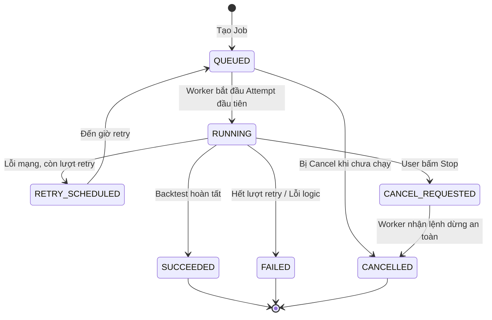
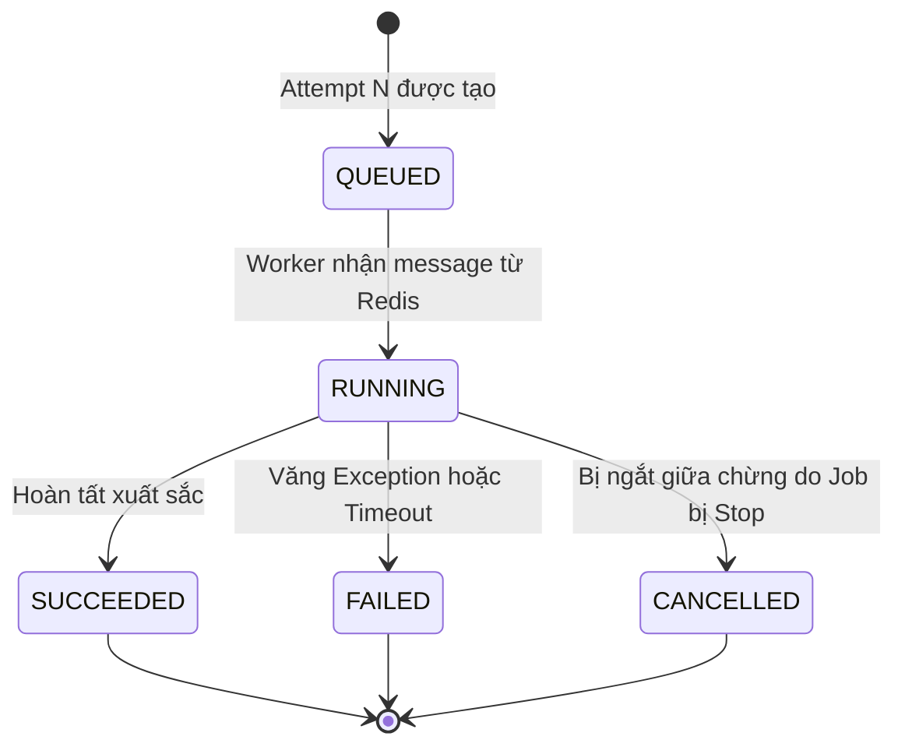

# Contract & State Machine: Candidate → Job → Execution Attempt

**Feature:** F-005 Experiment Persistence and Ownership  
**Owner:** Văn Minh (Domain Contract), Tiến (Integration & Infrastructure)  
**Date:** 2026-08-30  

Tài liệu này định nghĩa rõ ranh giới, sơ đồ trạng thái và Interface (Hợp đồng) giữa phần Domain Core (do Văn Minh phụ trách) và phần Infrastructure/Persistence (do Tiến phụ trách) để đảm bảo hai bên có thể làm việc độc lập.

## 1. Ranh giới trách nhiệm (Boundaries)

- **Lớp Domain (Văn Minh):** Chứa các Entity, Aggregate Root (`Job`, `ExecutionAttempt`), định nghĩa trạng thái, quyết định khi nào được phép chuyển trạng thái, logic tính toán số lần Retry (Exponential Backoff), và phân loại lỗi (`FailureClassification`). Lớp Domain **không** biết về Redis, PostgreSQL, hay HikariCP.
- **Lớp Infrastructure & Application (Tiến):** Chứa các Service gọi Database, ghi Log, tương tác Redis (Outbox). Nhiệm vụ của Tiến là lấy Data từ CSDL -> Map thành Domain Model -> Gọi các hàm chuyển trạng thái của Domain Model -> Lưu ngược xuống CSDL. Tiến cũng bắt các `Exception` hệ thống và Map chúng thành `FailureClassification` để báo cho Domain.

| Thực thể | Trách nhiệm cốt lõi (Domain) | Trách nhiệm của Tiến (Infrastructure) |
| :--- | :--- | :--- |
| **Candidate** | Cấu hình tham số bất biến. Thuộc về Experiment. | Ánh xạ ID từ Database |
| **Job** | Tổng thể 1 tiến trình (Search/Backtest). Tính thời gian Retry tiếp theo, đếm số lần chạy. | Lưu DB, ghi Outbox Pattern. |
| **Execution Attempt** | Lưu vết 1 lần Worker cụ thể nhận việc, thời gian thực thi, nguyên nhân lỗi. | Cập nhật DB khi Worker nhận message và kết thúc. |

---

## 2. Quyết định thiết kế (Design Decisions)

Dựa trên các cuộc họp bảo vệ kiến trúc, nhóm đã chốt 3 nguyên tắc cực kỳ quan trọng cho phần này:

1. **Cancel Propagation (Hủy ngang Job bằng Polling):** Không dùng `Thread.interrupt()` để ngắt Worker vì nguy cơ corrupt trạng thái DB hoặc rò rỉ Connection Pool. Job sẽ bộc lộ method `isCancelRequested()`. Tiến sẽ thiết kế Worker tự động gọi hàm này ở các "safe checkpoint" (điểm an toàn - ví dụ sau khi backtest xong 1 batch dữ liệu nến). Nếu trả về true, Worker sẽ chủ động thoát an toàn.
2. **Logic tính toán Retry Delay (Đóng gói trong Domain):** Công thức `next_retry_at = now + (2^attempt * delay)` phải được đặt trong entity `Job` (`Job.scheduleRetry()`). Điều này tuân thủ Rich Domain Model, giúp Văn Minh dễ dàng viết Unit Test độc lập hoàn toàn với Spring Boot.
3. **Phân loại lỗi (Transient vs Permanent):** Domain Contract định nghĩa sẵn enum `FailureClassification` (`TRANSIENT_NETWORK_ERROR`, `PERMANENT_LOGIC_ERROR`...). Tiến sẽ bắt Exception ở tầng Worker (VD: `PSQLException`) và chuyển nó thành enum tương ứng rồi truyền cho Domain. Domain sẽ tự quyết định nên `RETRY_SCHEDULED` hay `FAILED`.

---

## 3. Sơ đồ State Machine (Trạng thái)

*(Lưu ý: Mọi transition phải được validate ở Backend, frontend không được phép ghi đè).*

### 3.1. Job State Machine (Đại diện cho toàn bộ tiến trình)


### 3.2. Execution Attempt State Machine (Đại diện cho 1 lần Worker thử)


---

## 4. Java Contract Interfaces (Domain Layer)

Các file này được định nghĩa tại `modules/experiment/src/main/java/com/cryptostrategy/platform/experiment/domain/job/`. 

### 4.1. Failure Classification Enum
```java
public enum FailureClassification {
    TRANSIENT_NETWORK_ERROR,   // Redis timeout, DB connection đứt -> Cho phép Retry
    DATA_UNAVAILABLE_RETRY,    // Dataset đang chuẩn bị -> Cho phép Retry có backoff dài hơn
    PERMANENT_LOGIC_ERROR,     // Sai logic Strategy, Invalid param -> Bỏ qua Retry, FAILED ngay
    WORKER_CRASHED,            // Worker chết ngang / Timeout -> Retry
    UNKNOWN_ERROR
}
```

### 4.2. Job Aggregate Root
Định nghĩa hành vi thay đổi trạng thái thay vì chỉ dùng setter (Rich Domain Model).

```java
public interface Job {
    JobId getId();
    ExperimentId getExperimentId();
    CandidateId getCandidateId(); // Nullable nếu là Search Job
    JobType getType(); // SEARCH or BACKTEST
    JobStatus getStatus();
    
    // Polling cho Cancel
    boolean isCancelRequested();
    
    // Core Transitions
    ExecutionAttempt startNewAttempt(WorkerId workerId, Instant startTime);
    void recordProgress(int completedWork, Instant updateTime);
    void markSucceeded(ExecutionAttempt attempt, Instant completionTime);
    
    // Policy-driven failure handling (Chứa logic tính toán Retry Delay)
    void handleFailure(ExecutionAttempt attempt, FailureClassification failure, Instant failedAt);
    
    // Stop requests
    void requestCancel();
    void confirmCancelled(Instant cancelledAt);
}
```

### 4.3. Execution Attempt Entity
```java
public interface ExecutionAttempt {
    AttemptId getId();
    JobId getJobId();
    int getAttemptNumber();
    WorkerId getWorkerId();
    AttemptStatus getStatus();
    
    // Transitions
    void markRunning(Instant startTime);
    void markSucceeded(Instant endTime);
    void markFailed(FailureClassification failure, String errorMessage, Instant endTime);
    void markCancelled(Instant endTime);
}
```

---
**Note cho Tiến:** Bạn hãy dựa vào file Contract này để viết các `Repository` và `Application Service` nhé. Không cần thay đổi interface của Domain. Mọi Exception của hệ thống bên dưới hãy catch lại và map sang `FailureClassification` trước khi gọi `job.handleFailure()`.
