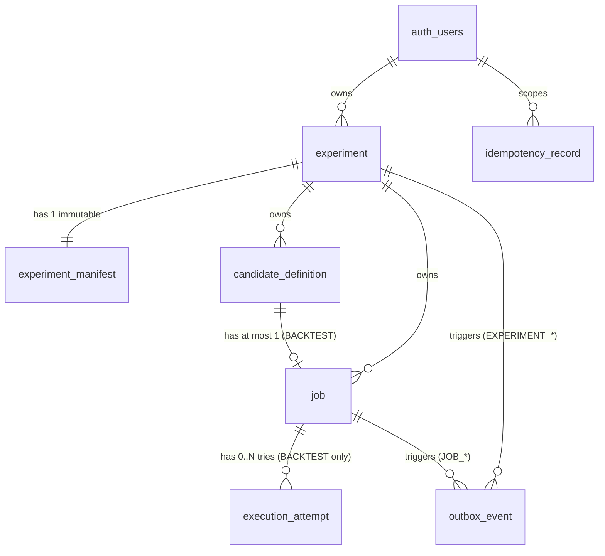

# Data Model: F-005 Experiment Persistence and Ownership

**Feature**: F-005 — Experiment Persistence and Ownership  
**Branch**: `feature/005-experiment-persistence`  
**Directory**: `specs/005-durable-job-persistence`  
**Status**: Draft  
**Date**: 2026-08-30  

---

## 1. Entity-Relationship Overview



---

## 2. Core Entities & Table Mappings

### 2.1. `experiment.experiment` (Experiment Aggregate Root)

Represents the top-level Experiment entity owned by a single authenticated Supabase user.

| Column | Type | Constraints | Description |
|---|---|---|---|
| `experiment_id` | `VARCHAR(26)` | `PRIMARY KEY`, ULID pattern | Unique Crockford ULID identifier |
| `owner_user_id` | `UUID` | `NOT NULL REFERENCES auth.users(id)` | Authorization root (Supabase Auth UUID) |
| `derived_from_experiment_id` | `VARCHAR(26)` | `REFERENCES experiment.experiment(experiment_id)` | Lineage link to parent Experiment variation |
| `reproduces_experiment_id` | `VARCHAR(26)` | `REFERENCES experiment.experiment(experiment_id)` | Explicit link to the Experiment being reproduced |
| `name` | `TEXT` | `NOT NULL`, `CHECK (name <> '')` | Display name of the Experiment |
| `status` | `TEXT` | `NOT NULL CHECK (status IN ('CREATED', 'QUEUED', 'RUNNING', 'COMPLETED', 'FAILED', 'STOP_REQUESTED', 'STOPPED'))` | Lifecycle runtime status |
| `started_at` | `TIMESTAMPTZ` | `NULL` | Timestamp when first Worker/Search starts |
| `completed_at` | `TIMESTAMPTZ` | `NULL` | Timestamp when Experiment reaches terminal status |
| `failure_code` | `TEXT` | `NULL` | Error classification code if Experiment fails |
| `failure_message` | `TEXT` | `NULL` | Diagnostic failure message |
| `created_at` | `TIMESTAMPTZ` | `NOT NULL DEFAULT NOW()` | Creation timestamp |

**Indexes**:
- `experiment_owner_created_idx` ON `experiment.experiment (owner_user_id, created_at DESC)`
- `experiment_status_created_idx` ON `experiment.experiment (status, created_at)`

---

### 2.2. `experiment.experiment_manifest` (Immutable Provenance Snapshot)

Stores the exact inputs required to reproduce the Experiment. Mutable only during `CREATED` phase; permanently frozen upon `CREATED → QUEUED` transition.

| Column | Type | Constraints | Description |
|---|---|---|---|
| `experiment_id` | `VARCHAR(26)` | `PRIMARY KEY REFERENCES experiment.experiment(experiment_id)` | 1-to-1 link to Experiment |
| `manifest_version` | `TEXT` | `NOT NULL CHECK (manifest_version <> '')` | Schema version of the manifest contract (e.g. `'1.0'`) |
| `dataset_version_id` | `VARCHAR(26)` | `NOT NULL REFERENCES market.dataset_version(dataset_version_id)` | Canonical F-003 `DatasetVersionId`; stable downstream Dataset identity (F-003 defines no separate Dataset root) |
| `strategy_kind` | `TEXT` | `NOT NULL CHECK (strategy_kind IN ('SINGLE', 'COMPOSITE'))` | Strategy architecture type |
| `strategy_ref_id` | `TEXT` | `NOT NULL CHECK (strategy_ref_id <> '')` | Plugin ID or Composite ID |
| `strategy_version` | `TEXT` | `NOT NULL CHECK (strategy_version <> '')` | Semantic version of strategy implementation |
| `strategy_parameters` | `JSONB` | `NOT NULL` | Exact parameter snapshot |
| `backtest_config` | `JSONB` | `NOT NULL` | Initial capital, fee rate, slippage, execution price rule |
| `search_config` | `JSONB` | `NOT NULL` | Algorithm, seed, stop conditions, top-K |
| `evaluation_config` | `JSONB` | `NOT NULL` | Metric formulas and ranking versions |
| `sentiment_config` | `JSONB` | `NULL` | Optional sentiment dataset reference & model version |
| `software_version` | `TEXT` | `NOT NULL CHECK (software_version <> '')` | Application artifact version |
| `git_commit` | `TEXT` | `NOT NULL CHECK (git_commit <> '')` | Git commit SHA |
| `fingerprint` | `TEXT` | `NULL while CREATED; MUST be non-empty from QUEUED onward` | Deterministic SHA-256 canonical hash computed at freeze |
| `source_user_strategy_version_id` | `VARCHAR(26)` | `NULL REFERENCES strategy.user_strategy_version(user_strategy_version_id)` | Optional provenance link to user's saved strategy |
| `created_at` | `TIMESTAMPTZ` | `NOT NULL DEFAULT NOW()` | Snapshot creation timestamp |

**F-003 Dataset provenance mapping**:

- `dataset_version_id` is the authoritative F-003 Dataset identity. F-005 MUST NOT add a separate `dataset_id`.
- F-003 Dataset Version evidence is immutable. When building/verifying the Manifest and its fingerprint, F-005 materializes the published F-003 metadata: `version` (`candle-v1`), checksum, provider, Trading Pair, Timeframe, `normalizationVersion`, `rangeStart`, `rangeEnd`, and `candleCount`.
- F-005 does not own Dataset membership or checksum calculation and does not write to `market.*` Dataset evidence.
- No additional F-005 Dataset provenance columns are required solely to duplicate immutable F-003 metadata; the FK remains the durable provenance anchor.

**Indexes & Triggers**:
- `experiment_manifest_fingerprint_idx` ON `experiment.experiment_manifest (fingerprint)` WHERE `fingerprint IS NOT NULL`
- Freeze invariant: the `CREATED → QUEUED` transaction MUST set a non-empty fingerprint before the Experiment status is committed as `QUEUED`; after `QUEUED`, Manifest updates are rejected.
- `experiment_manifest_user_strategy_version_idx` ON `experiment.experiment_manifest (source_user_strategy_version_id)`
- Trigger `experiment_manifest_user_strategy_owner_guard`: Ensures `source_user_strategy_version_id` belongs to the same `owner_user_id` as the Experiment and is `PUBLISHED`.

---

### 2.3. `experiment.candidate_definition` (Immutable Strategy Candidate)

Represents an individual strategy parameter combination generated for an Experiment.

| Column | Type | Constraints | Description |
|---|---|---|---|
| `candidate_id` | `VARCHAR(26)` | `PRIMARY KEY`, ULID pattern | Unique Crockford ULID identifier |
| `experiment_id` | `VARCHAR(26)` | `NOT NULL REFERENCES experiment.experiment(experiment_id)` | Owning Experiment |
| `generation_index` | `INTEGER` | `NOT NULL CHECK (generation_index >= 0)` | Deterministic order index from search generator |
| `definition` | `JSONB` | `NOT NULL` | Exact strategy parameter specification |
| `generator_state` | `JSONB` | `NULL` | Optional generator state snapshot |
| `fingerprint` | `TEXT` | `NOT NULL CHECK (fingerprint <> '')` | Deterministic SHA-256 hash of candidate definition |
| `created_at` | `TIMESTAMPTZ` | `NOT NULL DEFAULT NOW()` | Creation timestamp |

**Unique Constraints & Composite Keys**:
- `candidate_generation_unique`: `UNIQUE (experiment_id, generation_index)`
- `candidate_fingerprint_unique`: `UNIQUE (experiment_id, fingerprint)`
- `candidate_id_experiment_unique`: `UNIQUE (candidate_id, experiment_id)` (target of Job composite FK)

---

### 2.4. `experiment.job` (Durable Work Identity)

Represents the durable logical execution unit for a Search coordination or Backtest operation.

| Column | Type | Constraints | Description |
|---|---|---|---|
| `job_id` | `VARCHAR(26)` | `PRIMARY KEY`, ULID pattern | Unique Crockford ULID identifier |
| `experiment_id` | `VARCHAR(26)` | `NOT NULL REFERENCES experiment.experiment(experiment_id)` | Owning Experiment |
| `candidate_id` | `VARCHAR(26)` | `NULL` (NULL for SEARCH; NOT NULL for BACKTEST) | Target candidate definition |
| `job_type` | `TEXT` | `NOT NULL CHECK (job_type IN ('SEARCH', 'BACKTEST'))` | Type of logical work |
| `status` | `TEXT` | `NOT NULL CHECK (status IN ('QUEUED', 'RUNNING', 'RETRY_SCHEDULED', 'SUCCEEDED', 'FAILED', 'CANCEL_REQUESTED', 'CANCELLED'))` | Durable job status |
| `correlation_id` | `VARCHAR(26)` | `NOT NULL`, ULID pattern | Distributed tracing correlation identifier |
| `total_work` | `INTEGER` | `NOT NULL CHECK (total_work > 0)` | Total units of work (e.g. 1 for Backtest, N for Search) |
| `completed_work` | `INTEGER` | `NOT NULL DEFAULT 0 CHECK (completed_work >= 0)` | Completed units counter |
| `failed_work` | `INTEGER` | `NOT NULL DEFAULT 0 CHECK (failed_work >= 0)` | Failed units counter |
| `best_score` | `NUMERIC(20,10)` | `NULL` | Current best evaluation score |
| `queued_at` | `TIMESTAMPTZ` | `NULL` | Initial enqueue timestamp |
| `started_at` | `TIMESTAMPTZ` | `NULL` | First start timestamp |
| `finished_at` | `TIMESTAMPTZ` | `NULL` | Final completion timestamp |
| `next_retry_at` | `TIMESTAMPTZ` | `NULL` | Scheduled retry timestamp |
| `failure_code` | `TEXT` | `NULL` | Classification of terminal failure |
| `failure_message` | `TEXT` | `NULL` | Error details |
| `created_at` | `TIMESTAMPTZ` | `NOT NULL DEFAULT NOW()` | Record creation timestamp |
| `updated_at` | `TIMESTAMPTZ` | `NOT NULL DEFAULT NOW()` | Record last-update timestamp |

**Invariants & Constraints**:
- `job_candidate_experiment_fk`: `FOREIGN KEY (candidate_id, experiment_id) REFERENCES experiment.candidate_definition(candidate_id, experiment_id)`
- `job_type_candidate_valid`: `CHECK ((job_type = 'SEARCH' AND candidate_id IS NULL) OR (job_type = 'BACKTEST' AND candidate_id IS NOT NULL))`
- `job_progress_valid`: `CHECK (completed_work + failed_work <= total_work)`
- `job_identity_candidate_unique`: `UNIQUE (job_id, candidate_id)` (target of Attempt composite FK)
- `job_search_experiment_unique`: `UNIQUE INDEX (experiment_id) WHERE job_type = 'SEARCH'`
- `job_backtest_candidate_unique`: `UNIQUE INDEX (candidate_id) WHERE job_type = 'BACKTEST'`
- `job_recovery_idx`: `INDEX (status, next_retry_at, created_at) WHERE status IN ('QUEUED', 'RUNNING', 'RETRY_SCHEDULED', 'CANCEL_REQUESTED')`

---

### 2.5. `experiment.execution_attempt` (Append-Only Worker Try History)

Records each individual Worker try under a Backtest Job.

| Column | Type | Constraints | Description |
|---|---|---|---|
| `attempt_id` | `VARCHAR(26)` | `PRIMARY KEY`, ULID pattern | Unique Crockford ULID identifier |
| `job_id` | `VARCHAR(26)` | `NOT NULL`, ULID pattern | Parent Job reference |
| `candidate_id` | `VARCHAR(26)` | `NOT NULL REFERENCES experiment.candidate_definition(candidate_id)` | Redundant consistency link |
| `attempt_no` | `INTEGER` | `NOT NULL CHECK (attempt_no > 0)` | Monotonically increasing attempt number (1, 2, 3...) |
| `status` | `TEXT` | `NOT NULL CHECK (status IN ('QUEUED', 'RUNNING', 'SUCCEEDED', 'FAILED', 'CANCELLED'))` | Terminal execution status |
| `worker_id` | `TEXT` | `NULL` | Node/pod identifier of executing worker |
| `started_at` | `TIMESTAMPTZ` | `NULL` | When worker began execution |
| `finished_at` | `TIMESTAMPTZ` | `NULL` | When worker concluded execution |
| `next_retry_at` | `TIMESTAMPTZ` | `NULL` | Legacy compatibility column if already present; F-005 retry scheduling uses `experiment.job.next_retry_at` as authoritative |
| `failure_code` | `TEXT` | `NULL` | Error classification code |
| `failure_message` | `TEXT` | `NULL` | Error message or stack trace snippet |
| `retryable` | `BOOLEAN` | `NULL` | True if failure classified as transient/retryable |
| `created_at` | `TIMESTAMPTZ` | `NOT NULL DEFAULT NOW()` | Row creation timestamp |

**Invariants & Constraints**:
- `execution_attempt_job_candidate_fk`: `FOREIGN KEY (job_id, candidate_id) REFERENCES experiment.job(job_id, candidate_id)`
- `execution_job_attempt_unique`: `UNIQUE (job_id, attempt_no)`
- **Forward Migration Modification**: Tighten `status` check constraint to remove legacy `'RETRY_SCHEDULED'`.

---

### 2.6. `platform.idempotency_record` (Durable Idempotency Store)

Maintains command idempotency outcomes scoped by owner, operation, and client key.

| Column | Type | Constraints | Description |
|---|---|---|---|
| `user_id` | `UUID` | `NOT NULL REFERENCES auth.users(id)` | Authenticated owner UUID |
| `scope` | `TEXT` | `NOT NULL CHECK (scope <> '')` | Operation scope (e.g. `'CREATE_EXPERIMENT'`, `'FREEZE_EXPERIMENT'`) |
| `idempotency_key` | `TEXT` | `NOT NULL CHECK (idempotency_key <> '')` | Client-supplied unique key |
| `request_hash` | `TEXT` | `NOT NULL CHECK (request_hash <> '')` | SHA-256 of canonical request payload; active conflict gate |
| `state` | `TEXT` | `NOT NULL CHECK (state IN ('IN_PROGRESS', 'COMPLETED'))` | Durable claim lifecycle |
| `resource_type` | `TEXT` | `NULL` | Target aggregate type (e.g. `'EXPERIMENT'`, `'JOB'`) |
| `resource_id` | `VARCHAR(26)` | `NULL` | Resulting resource ULID |
| `outcome_code` | `TEXT` | `NULL` | Application-level outcome code; HTTP mapping belongs to F-009 |
| `response_body` | `JSONB` | `NULL` | Cached application outcome; populated when completed |
| `created_at` | `TIMESTAMPTZ` | `NOT NULL DEFAULT NOW()` | Creation timestamp |
| `expires_at` | `TIMESTAMPTZ` | `NOT NULL` | Expiry timestamp |

**Primary Key & Indexes**:
- `PRIMARY KEY (user_id, scope, idempotency_key)`
- `CHECK ((state = 'IN_PROGRESS' AND outcome_code IS NULL) OR (state = 'COMPLETED' AND outcome_code IS NOT NULL))`
- `idempotency_expiry_idx` ON `platform.idempotency_record (expires_at)`
- Claim operation must be atomic (`INSERT ... ON CONFLICT DO NOTHING` or equivalent), so exactly one concurrent first request acquires execution.

---

### 2.7. `platform.outbox_event` (Transactional Outbox Store)

Atomically records cross-boundary event publication intents for F-007 consumption.

| Column | Type | Constraints | Description |
|---|---|---|---|
| `outbox_event_id` | `VARCHAR(26)` | `PRIMARY KEY`, ULID pattern | Unique Crockford ULID identifier |
| `message_id` | `VARCHAR(26)` | `NOT NULL UNIQUE`, ULID pattern | Stable deduplication key for queue delivery |
| `aggregate_type` | `TEXT` | `NOT NULL CHECK (aggregate_type <> '')` | `'EXPERIMENT'` or `'JOB'` |
| `aggregate_id` | `VARCHAR(26)` | `NOT NULL`, ULID pattern | Resource ID |
| `event_type` | `TEXT` | `NOT NULL CHECK (event_type <> '')` | e.g. `'EXPERIMENT_QUEUED'`, `'JOB_QUEUED'`, `'JOB_CANCEL_REQUESTED'` |
| `event_version` | `TEXT` | `NOT NULL CHECK (event_version <> '')` | e.g. `'1.0'` |
| `payload` | `JSONB` | `NOT NULL` | Complete event routing/context payload |
| `headers` | `JSONB` | `NOT NULL DEFAULT '{}'::jsonb` | Metadata headers (trace IDs, timestamp) |
| `occurred_at` | `TIMESTAMPTZ` | `NOT NULL` | Event occurrence instant |
| `published_at` | `TIMESTAMPTZ` | `NULL` | Timestamp when F-007 publisher dispatches to Redis |
| `publish_attempts` | `INTEGER` | `NOT NULL DEFAULT 0 CHECK (publish_attempts >= 0)` | Publisher dispatch retry counter |
| `last_error` | `TEXT` | `NULL` | Last publication failure message |
| `created_at` | `TIMESTAMPTZ` | `NOT NULL DEFAULT NOW()` | Row insertion timestamp |

**Indexes**:
- `outbox_unpublished_idx` ON `platform.outbox_event (occurred_at) WHERE published_at IS NULL`

---

## 3. Forward Migration Plan

F-005 MUST use **new forward-only migration(s)**. Exact timestamps/file names should be chosen at implementation time after inspecting the current migration directory; already-applied migrations are never edited.

The forward migration plan must cover all schema alignment required by the finalized F-005 spec:

### 3.1. Experiment lineage and Manifest freeze alignment

- Add nullable `reproduces_experiment_id` self-reference if not already present.
- Allow `experiment_manifest.fingerprint` to be `NULL` during the `CREATED` phase.
- Enforce at the application transaction boundary that `CREATED → QUEUED` computes/stores a non-empty fingerprint before commit.
- Keep Manifest immutable once the Experiment is `QUEUED` or later.

### 3.2. Execution Attempt status alignment

Tighten `experiment.execution_attempt.status` to:

```sql
('QUEUED', 'RUNNING', 'SUCCEEDED', 'FAILED', 'CANCELLED')
```

`RETRY_SCHEDULED` is a Job-only status. If the existing Attempt table contains a legacy `next_retry_at` column, retain it for compatibility but do not treat it as authoritative; `experiment.job.next_retry_at` is the durable retry schedule.

### 3.3. Legacy Execution Attempt → Job backfill (FR-028)

Before enforcing final non-null/foreign-key assumptions, the migration must:

1. Identify legacy Attempt rows that do not have a valid parent `job_id`.
2. Derive a Job mapping only when the mapping is deterministic and unique from existing Experiment/Candidate data.
3. Abort the migration if any Attempt has zero or multiple possible parent Jobs; do not guess.
4. Backfill the valid mapping.
5. Assert that zero orphan Attempts remain.
6. Only then add/tighten the final FK/NOT NULL constraints required by the current schema.

This backfill must be tested with:
- an unambiguous legacy fixture (migration succeeds);
- an ambiguous legacy fixture (migration aborts);
- a post-migration assertion that no orphan Attempts remain.

### 3.4. Idempotency atomic-claim alignment

The durable idempotency table must support an `IN_PROGRESS` record before the command outcome exists:

- add/retain explicit `state IN ('IN_PROGRESS', 'COMPLETED')`;
- allow completion fields to be nullable while `IN_PROGRESS`;
- store application-level outcome metadata rather than coupling F-005 to an HTTP status;
- preserve uniqueness on `(user_id, scope, idempotency_key)`;
- use the unique key as the atomic claim guard.

### 3.5. Verification

All schema changes are verified locally with pgTAP/Supabase SQL tests. F-005 planning and implementation MUST NOT apply these migrations to a shared or remote Supabase environment without explicit human approval.
