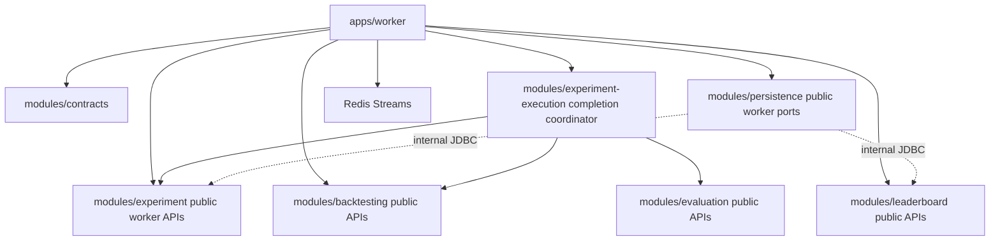

# Implementation Plan: F-007 — Worker and Reliable Job Processing

**Branch**: `feature/007-worker-reliable-job-processing`  
**Date**: 2026-09-01  
**Spec**: `specs/007-worker-reliable-job-processing/spec.md`  
**Planning Status**: Ready for `/speckit-checklist`

---

## Summary

F-007 provides the asynchronous orchestration layer between durable Experiment/Job state (F-005) and deterministic Backtest/Evaluation/Leaderboard capabilities (F-006).

This plan establishes:

1. **Versioned Redis integration contracts** for `backtest.jobs.v1`, `candidate.evaluated.v1`, `jobs.dead-letter.v1`, transient `progress.events.v1`, transient `lifecycle.events.v1`, and reserved `search.requests.v1`.
2. **Trusted Worker boundaries owned by F-005** so `apps/worker` never accepts `ownerUserId` from Redis and never reads F-005 tables directly.
3. **A worker-compatible execution seam in `modules/experiment-execution`** that preserves the existing F-006 business rules while avoiding the current F-005/F-006 success-order incompatibility.
4. **Duplicate-tolerant Outbox publication**. F-007 intentionally does not claim that a short `FOR UPDATE SKIP LOCKED` query holds exclusivity across Redis network I/O. Concurrent publishers may publish the same Outbox event; consumers remain idempotent.
5. **Dual-layer idempotency** using `platform.processed_message` plus the durable F-005/F-006 domain guards appropriate to each consumer.
6. **Recovery query boundaries** for QUEUED redispatch, due retry discovery, stale RUNNING Attempt recovery, and Leaderboard reconciliation without direct SQL in `apps/worker`.
7. **Single-owner progress semantics**: Backtest terminal progress is recorded exactly once from the Backtest completion path. Ranking does not increment candidate completion again.
8. **Cross-process transient progress/lifecycle notifications** over Redis Streams. PostgreSQL remains authoritative.
9. **No Search runtime**. `search.requests.v1` remains a reserved contract; Search Coordinator and Candidate generation stay deferred.

---

## Technical Context

**Language/Version**: Java 21  
**Primary Dependencies**: Spring Boot 3.5.x, Spring Data Redis/Lettuce, Jackson, SLF4J, ArchUnit  
**Storage**: PostgreSQL/Supabase for durable truth; Redis Streams for transient at-least-once delivery  
**Testing**: JUnit 5, Spring Boot tests, ArchUnit, PostgreSQL + Redis integration tests  
**Project Type**: multi-module modular monolith with standalone `apps/worker` runtime  
**Constraints**:
- PostgreSQL is the sole durable business truth.
- Redis may be wiped without losing Experiment/Job/Result truth.
- `apps/worker` must not import capability `internal..` packages or execute raw JDBC/SQL.
- Delivery is at-least-once; exactly-once Redis delivery is not claimed.
- Search Coordinator execution remains out of scope.
- No ungrounded latency, throughput, worker-count, or scale target is introduced by this plan.

---

## Constitution Check

| Principle | Status | Plan treatment |
|---|---|---|
| Domain purity | PASS | Worker coordinates public use cases only; business rules remain inside capability modules. |
| Modular monolith boundaries | PASS | Worker imports `*.api..` contracts only. Persistence implementation remains internal. |
| Immutability / reproducibility | PASS | Worker loads frozen F-005 execution evidence and canonical F-003/F-004 provenance through capability contracts. |
| Security / ownership | PASS | Trusted F-005 worker facade resolves `Job -> Experiment -> owner_user_id` internally. |
| Durable truth | PASS | Job/Attempt/Result/Evaluation/Leaderboard/Outbox/processed markers are PostgreSQL-backed; Redis is transient. |
| Forward-only schema policy | PASS | Current design requires no new F-007 table/column. Any implementation-discovered incompatibility must use a new migration, never edit an applied migration. |
| Search deferral | PASS | `search.requests.v1` is contract reservation only; no F-007 Search consumer/runtime. |

---

## Repository Compatibility Finding

The current repository has an important integration mismatch that the original plan did not account for:

- F-005 `finalizeSuccess(...)` transitions the Attempt and parent Job to `SUCCEEDED`.
- F-006 `RunBacktestUseCase` currently computes **and persists** the Backtest Result.
- F-006 persistence accepts a Result only when the referenced Attempt is already `SUCCEEDED`.

Therefore the Worker cannot safely do either of the naive sequences:

```text
RunBacktestUseCase while Attempt RUNNING
-> Result persistence rejects lineage
```

or:

```text
finalizeSuccess
-> RunBacktestUseCase
-> computation/persistence fails
-> Job was already durably SUCCEEDED
```

F-007 MUST resolve this without moving Backtest business logic into `apps/worker`.

### Chosen compatibility seam

Extend the F-006-owned public execution API without changing Backtest business rules:

1. `PrepareBacktestUseCase` computes an immutable prepared Backtest outcome using the same deterministic engine and frozen inputs, but does not persist the Result.
2. `CompleteBacktestAttemptUseCase` lives in `modules/experiment-execution` and commits a **short transaction**:
   - F-005 `finalizeSuccess(jobId, attemptId)`;
   - F-006 commit of the prepared Backtest Result (the Attempt is now `SUCCEEDED` inside the same transaction);
   - F-006 Evaluation persistence;
   - F-005 idempotent terminal-progress recording.
3. Any exception rolls the whole commit transaction back. Long Backtest computation happens before this transaction.
4. Existing F-006 `RunBacktestUseCase` may remain as the existing convenience composition for non-Worker callers; F-007 uses the worker-compatible prepare/commit seam.
5. The transaction coordinator is capability-owned (`modules/experiment-execution`), not implemented as raw transaction logic in `apps/worker`.

This preserves F-005 lineage semantics, F-006 Result lineage checks, short database lock duration, and crash safety.

---

## Project Structure

```text
specs/007-worker-reliable-job-processing/
├── spec.md
├── plan.md
├── research.md
├── data-model.md
├── quickstart.md
└── contracts/
    ├── redis-message-envelope.md
    ├── backtest-job-message.md
    ├── candidate-evaluated-message.md
    ├── dead-letter-message.md
    ├── progress-event-contract.md
    ├── lifecycle-event-contract.md
    ├── outbox-publication-contract.md
    ├── processed-message-contract.md
    ├── retry-recovery-contract.md
    ├── trusted-worker-boundary.md
    ├── worker-execution-commit-contract.md
    ├── leaderboard-reconciliation-contract.md
    └── search-requests-reservation.md
```

### Planned source ownership

```text
modules/contracts/
└── .../contracts/api/
    ├── MessageEnvelope.java
    ├── BacktestJobPayload.java
    ├── CandidateEvaluatedPayload.java
    ├── DeadLetterPayload.java
    ├── ProgressEventPayload.java
    ├── LifecycleNotificationPayload.java
    └── SearchRequestPayload.java

modules/experiment/
└── .../experiment/api/port/in/
    ├── TrustedWorkerExperimentUseCase.java
    └── TrustedWorkerRecoveryQueryUseCase.java

modules/backtesting/
└── .../backtesting/api/port/in/
    ├── RunBacktestUseCase.java                 # existing
    ├── PrepareBacktestUseCase.java             # F-007 integration seam
    └── CommitPreparedBacktestUseCase.java      # F-007 integration seam

modules/experiment-execution/
└── .../execution/api/port/in/
    └── CompleteBacktestAttemptUseCase.java

modules/leaderboard/
└── .../leaderboard/api/port/in/
    └── LeaderboardReconciliationUseCase.java

modules/persistence/
└── .../persistence/api/worker/
    ├── OutboxPublicationPort.java
    └── ProcessedMessageStore.java

apps/worker/
└── .../worker/
    ├── consumer/
    │   ├── BacktestJobStreamListener.java
    │   └── RankingHandlerStreamListener.java
    ├── outbox/OutboxPublisherScheduledTask.java
    ├── reconciler/
    │   ├── QueueReconcilerScheduledTask.java
    │   ├── StaleJobReconcilerScheduledTask.java
    │   └── LeaderboardReconcilerScheduledTask.java
    ├── retry/
    │   ├── RetryOrchestratorScheduledTask.java
    │   ├── FailureClassifier.java
    │   └── ExponentialBackoffCalculator.java
    └── observability/
        ├── CorrelationContext.java
        └── WorkerMetrics.java
```

---

## Detailed Implementation Design

### 1. Dependency Map



`apps/worker` never imports internal persistence/capability packages.

---

### 2. Backtest Worker Flow

```mermaid
sequenceDiagram
    autonumber
    participant Redis as backtest.jobs.v1
    participant Worker as Backtest Worker
    participant Dedup as ProcessedMessageStore
    participant F005 as Trusted Worker F-005
    participant Backtest as PrepareBacktestUseCase
    participant Commit as CompleteBacktestAttemptUseCase
    participant EvalStream as candidate.evaluated.v1
    participant Progress as progress.events.v1

    Redis->>Worker: receive message
    Worker->>Dedup: isProcessed(consumerName, messageId)?
    alt already processed
        Worker->>Redis: XACK
    else new delivery
        Worker->>F005: getJob(jobId)
        alt Job terminal
            Worker->>Dedup: insertIfAbsent(...)
            Worker->>Redis: XACK
        else Job RUNNING
            Worker->>Worker: do not start a concurrent Attempt
            Note over Worker: leave pending/reclaimable; stale recovery owns orphan resolution
        else Job QUEUED
            Worker->>F005: startNextAttempt(jobId, workerId)
            Worker->>F005: getFrozenExecution(jobId)
            Worker->>Backtest: prepare(command)
            Note over Backtest: deterministic computation only; no Result persistence
            Worker->>Commit: complete(preparedOutcome, jobId, attemptId, evaluation config)
            Note over Commit: short DB transaction: F-005 success + Result + Evaluation + terminal progress
            Commit-->>Worker: durable result/evaluation IDs + score
            Worker->>EvalStream: XADD candidate.evaluated.v1
            Worker->>Progress: XADD BACKTEST_COMPLETED
            Worker->>Dedup: insertIfAbsent(...)
            Worker->>Redis: XACK
        end
    end
```

#### Failure branches

- Failure during **prepare/computation**:
  - classify in Worker;
  - retryable -> F-005 finalizes Attempt `FAILED`, Job `RETRY_SCHEDULED`, with `nextRetryAt`;
  - terminal -> F-005 finalizes Attempt/Job `FAILED` and records terminal failed progress exactly once;
  - no Backtest Result/Evaluation is persisted.
- Failure inside the **short completion transaction**:
  - transaction rolls back F-005 success and F-006 writes together;
  - Job/Attempt remain recoverable from the pre-commit durable state.
- Crash after completion commit but before `candidate.evaluated.v1` or `processed_message`:
  - Job/Attempt/Result/Evaluation/progress are already durable;
  - redelivery does not re-run the Backtest;
  - Leaderboard Reconciler repairs the missing fast-path ranking;
  - consumer repairs the processed marker where safe and acknowledges.

This closes the original `F-006 commit -> F-005 finalize` crash window.

---

### 3. Progress Ownership

Progress updates must not be double-counted.

- Backtest completion path is the **only owner** of candidate terminal completion counters.
- Success sets terminal Backtest Job progress idempotently (for a one-unit Backtest Job, success resolves to `completed_work = 1`, `failed_work = 0`) and may set the candidate score.
- Terminal failure sets `completed_work = 0`, `failed_work = 1`.
- Retryable failure does **not** count as terminal failed work.
- Ranking Handler MUST NOT increment `completed_work`/`failed_work`.
- Ranking Handler may emit `LEADERBOARD_UPDATED` after a successful idempotent projection.
- Per-Experiment candidate counts are derived from durable Backtest Job states (or from a future Search-owned aggregate Job); F-007 does not invent a second mutable aggregate counter.

The trusted F-005 worker API therefore exposes an **idempotent terminal progress setter**, not a blind `incrementProgress(...)`.

---

### 4. Ranking Handler and Durable Score Authority

`candidate.evaluated.v1` is only a fast-path notification.

- `overallScore` in the message is a diagnostic/hint field.
- Ranking MUST load/validate the authoritative `EvaluationResult` from F-006 durable state using `evaluationResultId`.
- Ranking does not trust Redis score data as business truth.
- Ranking invokes an F-006-owned `LeaderboardReconciliationUseCase.projectEvaluation(...)` (or equivalent public facade) which:
  - loads the canonical EvaluationResult;
  - loads the eligible Evaluation set for the Experiment;
  - delegates deterministic Top-K projection to existing F-006 logic;
  - remains idempotent under duplicate messages.
- Ranking Handler records `processed_message` only after the durable projection/no-op is complete, then `XACK`s.
- Ranking Handler emits `LEADERBOARD_UPDATED` to `progress.events.v1`; it does not increment candidate completion.

---

### 5. Leaderboard Reconciliation Rule

The reconciler MUST NOT use “Evaluation has no LeaderboardEntry” as the definition of “not projected”; valid low-scoring Evaluations may never appear in Top-K.

Instead:

1. `apps/worker` schedules an F-006-owned reconciliation use case.
2. F-006 loads the full durable **leaderboard-eligible Evaluation set** for each bounded candidate Experiment.
3. F-006 recomputes deterministic Top-K and calls the existing idempotent `ProjectLeaderboardUseCase`.
4. If the resulting fingerprint equals the latest Revision, the operation is a no-op.
5. Repeated reconciliation of an Evaluation outside Top-K is allowed and safe; absence from Top-K is never interpreted as missing processing.

No new projection-marker table is required for correctness.

---

### 6. Recovery Queries

`apps/worker` does not issue SQL such as `SELECT ... FROM experiment.job`.

F-005 exposes a trusted recovery query boundary with bounded methods conceptually equivalent to:

```java
List<RecoverableQueuedJob> findRecoverableQueuedJobs(Instant olderThan, int limit);
List<DueRetryJob> findDueRetries(Instant dueAtOrBefore, int limit);
List<StaleRunningAttempt> findStaleRunningAttempts(Instant startedBefore, int limit);
Job getJob(JobId jobId);
ExperimentStatus getExperimentStatus(ExperimentId experimentId);
```

Implementations live behind F-005/persistence adapters and revalidate durable state before mutations.

F-006 exposes its own Leaderboard reconciliation boundary; Worker does not query `evaluation_result` or `leaderboard_*` directly.

---

### 7. Retry and Stale Attempt Recovery

- Retry parameters and budgets are environment-configurable; this plan does not hard-code default timing values.
- Worker computes `nextRetryAt` from configured policy and passes it to F-005.
- Retry Orchestrator uses `findDueRetries(...)`, then `requeueDueRetry(jobId)`.
- `RETRY_SCHEDULED -> QUEUED` remains an F-005 transition and writes `JobQueued`.
- Cancel vs retry race remains serialized by F-005 durable Job locking.
- Stale Attempt Reconciler uses `findStaleRunningAttempts(...)`, re-reads durable state, and invokes F-005 failure finalization only when the Attempt is still RUNNING and no completion transaction committed.

Because the completion transaction is atomic, a committed F-006 Result/Evaluation cannot coexist with an uncommitted F-005 success transition in the new worker path.

---

### 8. Outbox Publication and Multi-Publisher Semantics

F-007 intentionally chooses **duplicate-tolerant at-least-once publication**, not long-lived database row locks.

#### Discovery

```sql
SELECT ...
FROM platform.outbox_event
WHERE published_at IS NULL
ORDER BY occurred_at ASC
LIMIT :batchSize;
```

This is a scan, not an exclusive durable claim. Two publisher instances may read the same row.

#### Why no `FOR UPDATE SKIP LOCKED` claim

A PostgreSQL row lock ends when the transaction ends. Holding the lock while performing Redis network I/O would create an unnecessarily long database transaction. Returning rows from a short transaction and publishing later would no longer be protected by the lock. Therefore this plan does not claim exclusivity from `SKIP LOCKED`.

Duplicate physical publication is permitted and covered by consumer idempotency.

#### Publication completion

- Success:
  - increment `publish_attempts` for the physical attempt;
  - set `published_at` only if it was still null (`COALESCE`/conditional update);
  - clear `last_error`.
- Failure:
  - increment `publish_attempts`;
  - keep `published_at` null;
  - store only a safe diagnostic;
  - a late failure must not overwrite a success recorded by another publisher.
- Suppression:
  - no Redis publish occurs;
  - mark the Outbox row completed/suppressed explicitly;
  - do not increment `publish_attempts`;
  - store a safe `SUPPRESSED_*` audit reason using the existing schema.

No new lease columns are required.

---

### 9. Outbox Event Routing

All F-005 Outbox types receive explicit treatment:

| F-005 Outbox event | Routing | F-007 behavior |
|---|---|---|
| `JobQueued` for BACKTEST | `backtest.jobs.v1` | publish only while Job remains dispatchable `QUEUED` |
| `JobQueued` for SEARCH | `lifecycle.events.v1` | notification only; MUST NOT start Search runtime in F-007 |
| `ExperimentQueued` | `lifecycle.events.v1` | lifecycle notification; no Search execution |
| `ExperimentStopRequested` | `lifecycle.events.v1` | lifecycle/control notification |
| `JobCancelRequested` | `lifecycle.events.v1` | cancellation notification; may suppress if Job already CANCELLED |
| `JobCancelled` | `lifecycle.events.v1` | publish; MUST NOT suppress merely because status is CANCELLED |

`search.requests.v1` remains reserved and is not produced/consumed for Search execution by F-007.

`lifecycle.events.v1` is a transient internal notification stream. F-007 publishes it but has no operational consumer; future Search/F-009/control-plane code may consume it.

---

### 10. Progress Transport Across JVMs

Spring `ApplicationEvent` is not a valid cross-process boundary because `apps/worker` and the future F-009 API runtime are separate JVMs.

F-007 therefore uses:

```text
progress.events.v1
```

as a transient versioned Redis Stream.

- Producer: `apps/worker`.
- F-007 consumer: none.
- Future consumer: F-009.
- Message types: `EXPERIMENT_PROGRESS_UPDATED`, `BACKTEST_COMPLETED`, `LEADERBOARD_UPDATED`.
- Durable state is always read back from PostgreSQL/F-005/F-006; loss of this stream only loses a notification, not truth.

---

## Database Changes & Migrations

**Plan status**: **NO NEW F-007 SCHEMA CHANGE REQUIRED by the corrected design**, subject to implementation-time inspection of the current migration directory.

Rationale:

- Existing `platform.outbox_event` supports unpublished scan, attempts, failure diagnostics, and completion timestamp.
- Existing `platform.processed_message` supports completed-marker deduplication.
- F-005 Job/Attempt and F-006 Result/Evaluation/Leaderboard tables already hold authoritative state.
- Multi-publisher safety intentionally relies on duplicate-tolerant delivery, not lease columns.
- Leaderboard reconciliation recomputes from existing durable Evaluation state and does not require a projection-marker table.

If implementation discovers an actual schema incompatibility, add a new forward-only migration. Never edit an applied migration.

---

## Message Compatibility Policy

- `messageVersion` is incremented for breaking changes.
- Consumers ignore unknown optional JSON properties.
- JSON Schemas therefore permit additional optional properties.
- Required field removal/rename/type changes require a new version/stream version.
- Java DTOs use Jackson unknown-property tolerance.
- Queue messages carry routing/reference data only; PostgreSQL/F-005/F-006 remains authoritative.

---

## Observability

Minimum metrics follow the spec, without adding ungrounded performance targets:

- queued Job count;
- running Job count;
- dead-letter count;
- Outbox unpublished age/lag;
- Backtest execution duration;
- retry count;
- consumer pending/lag;
- per-Experiment candidate progress derived from durable Job state;
- duplicate deliveries skipped;
- recovery operations performed.

MDC context is bound per consumed message and cleared in `finally`.

---

## Verification Plan

### Architecture

- Worker imports no `*.internal..` capability packages.
- Worker executes no raw JDBC/SQL.
- Public API/F-009 cannot import the trusted Worker facade.
- New prepare/commit APIs remain capability-owned.
- `modules/experiment-execution` is the cross-capability execution coordinator; business algorithms stay in F-006.

### PostgreSQL + Redis integration

Required tests:

1. `HappyPathBacktestWorkerIntegrationTest`
2. `DuplicateBacktestDeliveryIntegrationTest`
3. `DuplicateRankingDeliveryIntegrationTest`
4. `WorkerCrashAfterCompletionCommitIntegrationTest`
5. `WorkerCrashDuringCompletionTransactionIntegrationTest`
6. `PublisherCrashAfterRedisBeforeDbMarkIntegrationTest`
7. `OutboxConcurrentPublishersDuplicateSafeIntegrationTest`
8. `OutboxSuppressionAuditIntegrationTest`
9. `PendingMessageReclaimIntegrationTest`
10. `RedisLossQueueReconcilerIntegrationTest`
11. `StaleRunningAttemptRecoveryIntegrationTest`
12. `RetryCancelRaceIntegrationTest`
13. `LeaderboardLostFastPathReconciliationIntegrationTest`
14. `LowScoreEvaluationNotTopKReconciliationTest`
15. `ProgressNotificationLossDurableTruthTest`
16. `CrossJvmProgressStreamContractTest`
17. `DeadLetterLossDoesNotChangeJobTruthTest`
18. `UnknownMessageVersionRejectsWithoutInfiniteRetryTest`
19. `SearchJobQueuedDoesNotStartSearchRuntimeTest`
20. `TerminalProgressRecordedExactlyOnceTest`

### Planning readiness

After these corrected artifacts are committed, run `/speckit-checklist`. `/speckit-tasks` should be generated only after the checklist confirms that the new F-006 prepare/commit integration seam and F-005 recovery/progress APIs are fully represented.
