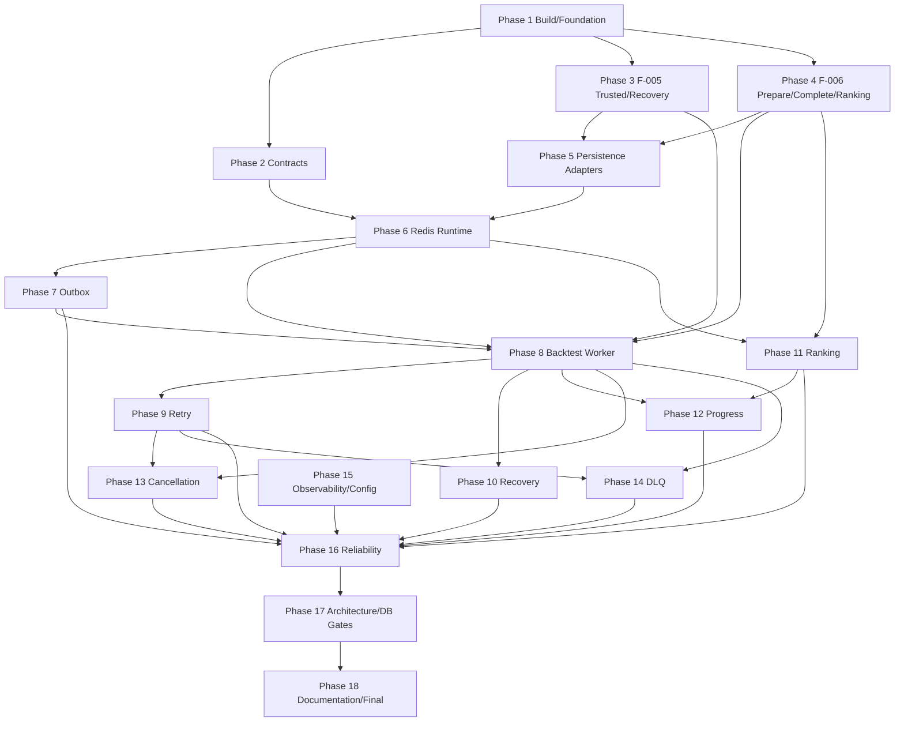

# Tasks: F-007 — Worker and Reliable Job Processing

**Feature**: F-007 — Worker and Reliable Job Processing  
**Branch**: `feature/007-worker-reliable-job-processing`  
**Feature Directory**: `specs/007-worker-reliable-job-processing/`  
**Primary Spec**: `specs/007-worker-reliable-job-processing/spec.md`  
**Plan Baseline**: revised F-007 `plan.md`, `research.md`, `data-model.md`, `quickstart.md`, and all contracts  
**Checklist Baseline**: revised `checklists/requirements.md`  
**Status**: Implementation Complete — 118/118 tasks completed and verified with `./gradlew check`

> These tasks preserve the corrected F-007 design: PostgreSQL is durable truth; Redis is transient at-least-once infrastructure; Outbox publication is duplicate-tolerant rather than a long-lived database claim; Backtest Worker uses the F-006 prepare/commit seam plus the `modules/experiment-execution` atomic completion coordinator; F-005 owns Job/Attempt/Experiment lifecycle and trusted recovery queries; Leaderboard reconciliation is F-006-owned and never equates “not in Top-K” with “unprocessed”; candidate terminal progress uses idempotent SET semantics and is not incremented by Ranking Handler.

---

## Phase 1: Build, Runtime Configuration, and Verification Foundation

**Purpose**: Establish dependencies, real Redis/PostgreSQL integration-test support, typed configuration, and the no-migration verification gate.

- [x] T001 [P] Update `gradle/libs.versions.toml`, `apps/worker/build.gradle.kts`, and affected module build files to add Spring Data Redis/Lettuce and test-only real Redis/PostgreSQL integration dependencies; add only the module dependencies required by the revised dependency map (`contracts`, `experiment`, `backtesting`, `evaluation`, `experiment-execution`, `leaderboard`, `persistence`) and do not add Search runtime dependencies for F-007 orchestration.
- [x] T002 [P] Configure isolated Worker integration-test infrastructure in `apps/worker/build.gradle.kts` and `apps/worker/src/test/resources/application-test.yml` so tests can run against disposable/local PostgreSQL and Redis without live Binance or other mutable external providers.
- [x] T003 [P] Implement typed `WorkerProperties` in `apps/worker/src/main/java/com/cryptostrategy/platform/worker/config/WorkerProperties.java` covering Redis endpoint, optional credentials, optional TLS/SSL, stream prefix/names, consumer groups/identity, read/reclaim batches, bounded in-flight concurrency, retry/backoff parameters, execution timeout, reconciliation intervals/batches, processed-message TTL, and graceful-shutdown timeout; do not hard-code production `maxAttempts` or TTL values not fixed by the spec.
- [x] T004 [P] Add `WorkerPropertiesTest` in `apps/worker/src/test/java/com/cryptostrategy/platform/worker/config/WorkerPropertiesTest.java` for property binding, required-value validation, optional secure Redis settings, and invalid retry/recovery horizon combinations.
- [x] T005 Verify the current applied schema and indexes against F-007 requirements in `modules/persistence/src/experimentIntegrationTest/java/com/cryptostrategy/platform/persistence/experiment/F007SchemaCompatibilityIntegrationTest.java`; explicitly verify `platform.outbox_event`, `platform.processed_message`, Job retry fields, Attempt timestamps/status, Result/Evaluation lineage, and Leaderboard fingerprint/revision state. If a required invariant is impossible with the current schema, mark **BLOCKER — DATABASE DESIGN REVIEW REQUIRED** instead of editing an applied migration.

**Checkpoint — Foundation Ready**: Build dependencies resolve, secure Redis configuration is representable, real infrastructure tests can run, and no schema change has been silently introduced.

---

## Phase 2: Versioned Integration Contracts

**Purpose**: Implement all versioned cross-process message contracts before runtime consumers/producers.

- [x] T006 [P] Implement `MessageEnvelope<T>` in `modules/contracts/src/main/java/com/cryptostrategy/platform/contracts/api/MessageEnvelope.java` with stable ULID `messageId`, positive `messageVersion`, UPPER_SNAKE_CASE `messageType`, UTC `occurredAt`, `correlationId`, and typed payload.
- [x] T007 [P] Implement `BacktestJobPayload` in `modules/contracts/src/main/java/com/cryptostrategy/platform/contracts/api/BacktestJobPayload.java` with only `experimentId`, `jobId`, and `candidateId`; do not add `ownerUserId`, Candle data, Strategy definitions, or frozen provenance as execution authority.
- [x] T008 [P] Implement `CandidateEvaluatedPayload` in `modules/contracts/src/main/java/com/cryptostrategy/platform/contracts/api/CandidateEvaluatedPayload.java` with routing/result references required by the revised contract; if `overallScore` is present, document/type it as notification metadata only, never authoritative ranking input.
- [x] T009 [P] Implement `DeadLetterPayload` in `modules/contracts/src/main/java/com/cryptostrategy/platform/contracts/api/DeadLetterPayload.java` with original logical message identity, Job/Experiment/Candidate references, canonical failure classification, and sanitized diagnostic reference only.
- [x] T010 [P] Implement `ProgressEventPayload` in `modules/contracts/src/main/java/com/cryptostrategy/platform/contracts/api/ProgressEventPayload.java` for transient `progress.events.v1` messages supporting `EXPERIMENT_PROGRESS_UPDATED`, `BACKTEST_COMPLETED`, and `LEADERBOARD_UPDATED` without embedding durable business state as authority.
- [x] T011 [P] Implement `LifecycleNotificationPayload` in `modules/contracts/src/main/java/com/cryptostrategy/platform/contracts/api/LifecycleNotificationPayload.java` for `lifecycle.events.v1`, covering `ExperimentQueued`, `ExperimentStopRequested`, SEARCH `JobQueued` notification-only routing, `JobCancelRequested`, and `JobCancelled`.
- [x] T012 [P] Implement reserved `SearchRequestPayload` in `modules/contracts/src/main/java/com/cryptostrategy/platform/contracts/api/SearchRequestPayload.java` strictly as schema documentation/compatibility; add no F-007 Search consumer, coordinator, Candidate generator, or stop-condition runtime.
- [x] T013 [P] Implement contract/version constants or typed message-type registry in `modules/contracts/src/main/java/com/cryptostrategy/platform/contracts/api/` so runtime routing cannot depend on internal Java class names.
- [x] T014 [P] Add `MessageContractSerializationTest` in `modules/contracts/src/test/java/com/cryptostrategy/platform/contracts/api/MessageContractSerializationTest.java` verifying ULID/version validation, UTC timestamps, forward-compatible unknown optional JSON fields, unsupported-version rejection, required-field failures, and absence of credentials/heavy business payloads.

**Checkpoint — Contracts Ready**: All F-007 streams have versioned DTOs and compatibility tests; `search.requests.v1` remains reservation-only.

---

## Phase 3: F-005 Trusted Worker, Recovery, Progress, and Stop-Completion Boundaries

**Purpose**: Give `apps/worker` trusted application boundaries without exposing owner-scoped user APIs or direct persistence access.

- [x] T015 Define `TrustedWorkerExperimentUseCase` in `modules/experiment/src/main/java/com/cryptostrategy/platform/experiment/api/port/in/TrustedWorkerExperimentUseCase.java` with Worker-safe operations for Job state lookup, `startNextAttempt`, frozen execution loading, success/failure/cancel finalization, cancel polling, due retry requeue, and idempotent `recordTerminalProgress`; do **not** add `hasDurableExecutionEvidence` because the revised prepare/atomic-complete seam removes that cross-module recovery probe.
- [x] T016 Define `TrustedWorkerRecoveryQueryUseCase` and minimal orchestration DTOs in `modules/experiment/src/main/java/com/cryptostrategy/platform/experiment/api/port/in/` for bounded `findRecoverableQueuedJobs`, `findDueRetries`, `findStaleRunningAttempts`, and stop-completion candidate discovery; return orchestration values, not persistence row models.
- [x] T017 Define an F-005-owned stop-completion boundary in `modules/experiment/src/main/java/com/cryptostrategy/platform/experiment/api/port/in/CompleteStoppedExperimentUseCase.java` (or equivalent repository-consistent public name) that may transition an Experiment to `STOPPED` only when it is `STOP_REQUESTED` and all child Jobs are terminal.
- [x] T018 Implement `TrustedWorkerExperimentService` in `modules/experiment/src/main/java/com/cryptostrategy/platform/experiment/internal/TrustedWorkerExperimentService.java` by delegating to canonical F-005 transition logic, resolving `Job -> Experiment -> owner_user_id` internally, and validating `Candidate -> Experiment` and `Attempt -> Job`; do not weaken existing user-facing owner-scoped APIs.
- [x] T019 Implement the F-005 recovery-query service in `modules/experiment/src/main/java/com/cryptostrategy/platform/experiment/internal/TrustedWorkerRecoveryQueryService.java` using F-005 stores/ports only, with bounded results and state revalidation before mutations.
- [x] T020 Add idempotent terminal progress semantics to the F-005 application/domain layer in `modules/experiment/src/main/java/com/cryptostrategy/platform/experiment/internal/JobApplicationService.java` and/or `JobAggregate.java`: successful one-unit Backtest Job resolves to `completed_work=1, failed_work=0`; terminal failed Job resolves to `completed_work=0, failed_work=1`; retryable Attempt failure does not count as terminal work; repeated same terminal outcome is a no-op rather than a blind increment.
- [x] T021 Implement the stop-completion transition in `modules/experiment/src/main/java/com/cryptostrategy/platform/experiment/internal/ExperimentApplicationService.java` (or a dedicated internal service) with F-005 serialization/locking and the invariant that no active child Job remains; do not rely on a Search Coordinator.
- [x] T022 Extend F-005-owned output ports under `modules/experiment/src/main/java/com/cryptostrategy/platform/experiment/api/port/out/` only as necessary for bounded queued/retry/stale/stop discovery and atomic progress/state checks; keep SQL and JDBC out of public input APIs and `apps/worker`.
- [x] T023 [P] Add `TrustedWorkerExperimentServiceTest`, `TrustedWorkerRecoveryQueryServiceTest`, and terminal-progress/stop-completion tests under `modules/experiment/src/test/java/com/cryptostrategy/platform/experiment/internal/` covering ownership derivation, parent-chain validation, duplicate terminal progress calls, retryable failure progress, cancel/retry guards, and STOPPED eligibility.
- [x] T024 Define expected-state terminal-finalization semantics in `modules/experiment/src/main/java/com/cryptostrategy/platform/experiment/api/port/out/ExecutionAttemptStore.java` and the F-005 application boundary so success/failure/cancel finalization can only win from the canonical active state (`Attempt=RUNNING` with the compatible active Job state); a stale or already-terminal transition must return an explicit conflict/no-op outcome or throw a typed state-transition exception rather than silently overwriting terminal state.
- [x] T025 Implement serialized/CAS terminal finalization in `modules/persistence/src/main/java/com/cryptostrategy/platform/persistence/internal/experiment/{ExperimentSql,JdbcExecutionAttemptStore}.java`: lock or atomically compare the authoritative Job/Attempt state in the same PostgreSQL transaction, conditionally update only the expected RUNNING state, verify affected-row counts, and prevent `SUCCEEDED`, `FAILED`, or `CANCELLED` from being overwritten by a competing late Worker, Stale Reconciler, or cancellation path; preserve owner predicates and require no schema migration.
- [x] T026 Add real PostgreSQL F-005 race coverage in `modules/persistence/src/experimentIntegrationTest/java/com/cryptostrategy/platform/persistence/experiment/AttemptFinalizationConcurrencyIntegrationTest.java` for concurrent `finalizeSuccess(...)` versus retryable `finalizeFailure(..., WORKER_CRASHED, ...)`: assert exactly one legal transition wins; if success wins the Job/Attempt remain `SUCCEEDED` and the stale failure is rejected/no-op, while if failure wins the Job becomes `RETRY_SCHEDULED` and the late success is rejected/no-op; assert no terminal overwrite, no Job/Attempt disagreement, and no retry scheduled after durable success.
- [x] T027 Add F-005 cancellation-versus-success race coverage in `modules/persistence/src/experimentIntegrationTest/java/com/cryptostrategy/platform/persistence/experiment/AttemptCancellationCompletionRaceIntegrationTest.java` proving `CANCEL_REQUESTED`/`finalizeCancelled(...)` and `finalizeSuccess(...)` cannot overwrite one another: exactly one legal durable Job/Attempt outcome wins according to the F-005 state machine and the losing terminal transition is rejected/no-op. Partial F-006 output behavior is verified later at the experiment-execution/Worker integration layer.

**Checkpoint — Durable Worker Boundary Ready**: Worker lifecycle/recovery calls are F-005-owned, owner identity is derived durably, progress/STOPPED transitions are idempotent and explicit, and competing terminal Attempt/Job finalizations are serialized so a late Worker, stale recovery, or cancellation cannot overwrite an already-terminal durable outcome.

---

## Phase 4: F-006 Worker-Compatible Backtest Completion and Leaderboard Reconciliation

**Purpose**: Close the F-006 persistence/F-005 finalization ordering problem without long transactions or business logic in Worker.

### 4.1 Prepare/Commit Backtest Seam

- [x] T028 Define immutable `PreparedBacktestOutcome` in `modules/backtesting/src/main/java/com/cryptostrategy/platform/backtesting/api/model/PreparedBacktestOutcome.java`, carrying the typed lineage and deterministic computed output required for later persistence but representing no durable truth by itself.
- [x] T029 Define `PrepareBacktestUseCase` in `modules/backtesting/src/main/java/com/cryptostrategy/platform/backtesting/api/port/in/PrepareBacktestUseCase.java` for deterministic Backtest computation without BacktestResult/Trade persistence.
- [x] T030 Define `CommitPreparedBacktestUseCase` in `modules/backtesting/src/main/java/com/cryptostrategy/platform/backtesting/api/port/in/CommitPreparedBacktestUseCase.java` for persistence of an already prepared outcome through existing F-006 lineage validation.
- [x] T031 Refactor `modules/backtesting/src/main/java/com/cryptostrategy/platform/backtesting/internal/RunBacktestService.java` and add prepare/commit internal services so existing `RunBacktestUseCase` remains compatible for non-Worker callers while F-007 can call prepare outside the completion transaction and commit inside it; do not duplicate `DeterministicBacktestEngine` logic.
- [x] T032 Extend the Worker-compatible prepare seam with a cancellation probe/callback at deterministic safe checkpoints in `modules/backtesting/src/main/java/com/cryptostrategy/platform/backtesting/api/` and the internal deterministic execution loop, so F-007 can poll F-005 cancellation without persisting partial Results or moving cancellation logic into business formulas.
- [x] T033 [P] Add Backtesting tests under `modules/backtesting/src/test/java/com/cryptostrategy/platform/backtesting/` proving `prepare(...)` is deterministic and persistence-free, `commit(...)` uses existing lineage rules, existing `RunBacktestUseCase` behavior remains compatible, and cancellation probe interruption leaves no Result/Trade persistence.

### 4.2 Atomic Cross-Capability Completion

- [x] T034 Define `CompleteBacktestAttemptUseCase` and `CompletedBacktestAttempt` result model under `modules/experiment-execution/src/main/java/com/cryptostrategy/platform/execution/api/port/in/` and `.../api/`, matching `contracts/worker-execution-commit-contract.md`.
- [x] T035 Implement `CompleteBacktestAttemptService` in `modules/experiment-execution/src/main/java/com/cryptostrategy/platform/execution/internal/CompleteBacktestAttemptService.java` so one short transaction performs F-005 `finalizeSuccess`, F-006 `CommitPreparedBacktestUseCase`, F-006 `EvaluateBacktestUseCase`, and F-005 `recordTerminalProgress(SUCCEEDED, score)`; any exception must roll all completion writes back and long Backtest computation must remain outside this transaction.
- [x] T036 Add a public experiment-execution composition entry point under `modules/experiment-execution/src/main/java/com/cryptostrategy/platform/execution/api/` and required `modules/experiment-execution/build.gradle.kts` dependency changes so `apps/worker` can obtain `CompleteBacktestAttemptUseCase` without importing `execution.internal` or leaking JDBC/transaction implementation types through the use-case API.
- [x] T037 [P] Add real PostgreSQL atomic-completion integration tests in `modules/persistence/src/backtestEvaluationLeaderboardIntegrationTest/java/com/cryptostrategy/platform/persistence/execution/BacktestAttemptCompletionIntegrationTest.java` proving: all success writes commit together; injected failure at Result/Evaluation/progress stages rolls back Job/Attempt success and F-006 writes; no committed F-006 output can coexist with an uncommitted F-005 success in the new Worker path; and a concurrent stale `finalizeFailure(..., WORKER_CRASHED, ...)` versus `CompleteBacktestAttemptUseCase` race produces exactly one legal winner, with the losing completion transaction rolling back Result/Evaluation/progress writes.

### 4.3 Durable Evaluation Read and Leaderboard Reconciliation

- [x] T038 Define F-006 `EvaluationResultReader` (or repository-consistent read port) in `modules/evaluation/src/main/java/com/cryptostrategy/platform/evaluation/api/port/out/` with canonical `findById`, bounded Experiment discovery, and durable eligible-Evaluation reads required by ranking/reconciliation.
- [x] T039 Implement `JdbcEvaluationResultReader` in `modules/persistence/src/main/java/com/cryptostrategy/platform/persistence/internal/evaluation/` and expose it through the existing `EvaluationPersistenceFactory`; add real PostgreSQL read/eligibility tests under `modules/persistence/src/backtestEvaluationLeaderboardIntegrationTest/java/com/cryptostrategy/platform/persistence/evaluation/`.
- [x] T040 Define `LeaderboardReconciliationUseCase` in `modules/leaderboard/src/main/java/com/cryptostrategy/platform/leaderboard/api/port/in/LeaderboardReconciliationUseCase.java` with `projectEvaluation(experimentId, evaluationResultId)` and bounded `reconcileBatch(limit)` semantics from `leaderboard-reconciliation-contract.md`.
- [x] T041 Implement `LeaderboardReconciliationService` in `modules/leaderboard/src/main/java/com/cryptostrategy/platform/leaderboard/internal/LeaderboardReconciliationService.java` to load authoritative EvaluationResult state, load the full leaderboard-eligible Evaluation set for bounded Experiments, delegate deterministic Top-K projection to existing `ProjectLeaderboardUseCase`, and rely on F-006 fingerprint/advisory-lock/idempotency behavior; never treat absence from `leaderboard_entry` as “unprocessed”.
- [x] T042 [P] Add `LeaderboardReconciliationServiceTest` and persistence integration coverage proving duplicate `projectEvaluation`, repeated `reconcileBatch`, low-scoring Evaluations outside Top-K, unchanged fingerprints, changed rankings, and Ranking-vs-reconciler races create no endless/duplicate logical revisions.

**Checkpoint — Atomic Execution and Ranking Boundaries Ready**: Worker can compute outside a transaction, atomically complete F-005/F-006 writes, and ask F-006 to reconcile ranking without querying Evaluation/Leaderboard tables directly.

---

## Phase 5: Persistence Adapters for F-007 Infrastructure and F-005 Recovery

**Purpose**: Implement Outbox and processed-message infrastructure while keeping Job recovery behind F-005 public use cases.

- [x] T043 Define `OutboxPublicationPort` in `modules/persistence/src/main/java/com/cryptostrategy/platform/persistence/api/worker/OutboxPublicationPort.java` with `listUnpublishedBatch`, `recordPublishSuccess`, `recordPublishFailure`, and `markSuppressed` exactly per the revised outbox contract; do not call the scan an exclusive claim.
- [x] T044 Implement `JdbcOutboxPublicationAdapter` in `modules/persistence/src/main/java/com/cryptostrategy/platform/persistence/internal/experiment/JdbcOutboxPublicationAdapter.java` using duplicate-tolerant `published_at IS NULL` scans, conditional success/failure updates, `COALESCE`/equivalent first-success preservation, safe suppression audit reasons, and no `FOR UPDATE SKIP LOCKED` claim across Redis I/O.
- [x] T045 Define `ProcessedMessageStore` in `modules/persistence/src/main/java/com/cryptostrategy/platform/persistence/api/worker/ProcessedMessageStore.java` with completed-marker lookup and `insertIfAbsent(...)` semantics keyed by `(consumer_name, message_id)`.
- [x] T046 Implement `JdbcProcessedMessageStore` in `modules/persistence/src/main/java/com/cryptostrategy/platform/persistence/internal/experiment/JdbcProcessedMessageStore.java` using `INSERT ... ON CONFLICT DO NOTHING`; keep TTL configurable and do not turn the table into an IN_PROGRESS lease/lock.
- [x] T047 Extend the existing public persistence factory pattern in `modules/persistence/src/main/java/com/cryptostrategy/platform/persistence/api/ExperimentPersistenceFactory.java` (and F-006 factories where needed) to create the new public infrastructure ports and the updated F-005 stores/readers without requiring `apps/worker` to import any `persistence.internal` class; do not recreate the superseded `WorkerPersistenceFactory` task/name.
- [x] T048 [P] Add real PostgreSQL integration tests under `modules/persistence/src/experimentIntegrationTest/java/com/cryptostrategy/platform/persistence/experiment/` for overlapping Outbox scans, concurrent successes, success-vs-late-failure, failed-attempt accounting, suppression audit, processed-marker duplicate inserts/TTL reads, bounded queued/retry/stale queries, and required index/query behavior; tests must describe duplicate-tolerant scans, not “batch claiming”.

**Checkpoint — Persistence Ports Ready**: Worker-accessible infrastructure ports are public and typed; lifecycle recovery remains F-005-owned; no new schema/lease table exists.

---

## Phase 6: Redis Consumer/Producer Runtime and Observability Foundation

**Purpose**: Create the transient transport runtime used by later user-story phases.

- [x] T049 Implement `RedisStreamConfiguration` in `apps/worker/src/main/java/com/cryptostrategy/platform/worker/config/RedisStreamConfiguration.java` for `backtest.jobs.v1` and `candidate.evaluated.v1` Consumer Groups, explicit/manual acknowledgement, configurable block/batch/pending-reclaim settings, environment stream prefixing, reconnect behavior, and no Search consumer group.
- [x] T050 Implement a typed Redis stream publication adapter in `apps/worker/src/main/java/com/cryptostrategy/platform/worker/messaging/RedisStreamPublisher.java` that serializes `MessageEnvelope` DTOs for `backtest.jobs.v1`, `candidate.evaluated.v1`, `jobs.dead-letter.v1`, `progress.events.v1`, and `lifecycle.events.v1` without exposing Redis/Jackson details to capability modules.
- [x] T051 [P] Implement `CorrelationContext` in `apps/worker/src/main/java/com/cryptostrategy/platform/worker/observability/CorrelationContext.java` with `correlationId`, `experimentId`, `jobId`, `candidateId` when applicable, and worker/consumer identity, with `AutoCloseable`/`finally` cleanup.
- [x] T052 [P] Implement `WorkerMetrics` in `apps/worker/src/main/java/com/cryptostrategy/platform/worker/observability/WorkerMetrics.java` for Redis pending/lag, queued/running Jobs, duplicate skips, retries, DLQ, Outbox unpublished age/failures, Queue/Stale/Leaderboard reconciliation, execution duration, and durable-progress observations.
- [x] T053 Wire only public module APIs/ports into `apps/worker/src/main/java/com/cryptostrategy/platform/worker/config/WorkerRuntimeConfiguration.java`, including F-005 trusted/recovery boundaries, F-006 prepare/completion/ranking boundaries, persistence infrastructure ports, Redis publisher/listeners, and schedulers; no `*.internal..`, JDBC, or raw SQL import is allowed.
- [x] T054 [P] Add Redis integration tests in `apps/worker/src/test/java/com/cryptostrategy/platform/worker/integration/RedisStreamInfrastructureIntegrationTest.java` covering stream/group creation, XREADGROUP, manual XACK, XAUTOCLAIM/XCLAIM behavior supported by the chosen Spring Data Redis API, multiple consumers, malformed JSON, unsupported `messageVersion`, and reconnect after Redis restart.

**Checkpoint — Redis Runtime Ready**: F-007 can publish/consume versioned at-least-once messages with explicit ACK and correlation context.

---

## Phase 7: User Story 1 — Outbox Dispatch and Complete Event Routing (Priority P1)

**Goal**: Reliably publish committed F-005 Outbox intents while accepting physical duplicates and routing every event type explicitly.

- [x] T055 [US1] Implement `OutboxEventRouter` in `apps/worker/src/main/java/com/cryptostrategy/platform/worker/outbox/OutboxEventRouter.java` using F-005 trusted reads for event-specific validation and this routing table: BACKTEST `JobQueued -> backtest.jobs.v1`; SEARCH `JobQueued -> lifecycle.events.v1` notification only; `ExperimentQueued`, `ExperimentStopRequested`, `JobCancelRequested`, `JobCancelled -> lifecycle.events.v1`; `JobCancelled` must not self-suppress because durable status is `CANCELLED`; unknown event types remain unpublished and operator-visible.
- [x] T056 [US1] Implement `OutboxPublisherScheduledTask` in `apps/worker/src/main/java/com/cryptostrategy/platform/worker/outbox/OutboxPublisherScheduledTask.java` using `OutboxPublicationPort.listUnpublishedBatch`, `OutboxEventRouter`, and `RedisStreamPublisher`; every physical XADD attempt records success/failure conditionally, suppression is audited without incrementing physical attempts, and a late failure cannot overwrite another publisher's success.
- [x] T057 [P] [US1] Add `OutboxToBacktestStreamIntegrationTest` in `apps/worker/src/test/java/com/cryptostrategy/platform/worker/integration/OutboxToBacktestStreamIntegrationTest.java` for Backtest `JobQueued` creation -> Outbox scan -> Redis message -> publication mark with stable IDs/correlation.
- [x] T058 [P] [US1] Add `MultiPublisherOutboxConcurrencyIntegrationTest` in `apps/worker/src/test/java/com/cryptostrategy/platform/worker/integration/MultiPublisherOutboxConcurrencyIntegrationTest.java` proving two publishers may read/publish the same logical row and still produce no lost durable event or duplicate business outcome; do not assert exclusive `SKIP LOCKED` claiming.
- [x] T059 [P] [US1] Add `OutboxPublishCrashWindowIntegrationTest` in `apps/worker/src/test/java/com/cryptostrategy/platform/worker/integration/OutboxPublishCrashWindowIntegrationTest.java` simulating Redis acceptance followed by process failure before `published_at` update, then republishing the same logical message safely.
- [x] T060 [P] [US1] Add `OutboxRoutingAndSuppressionIntegrationTest` in `apps/worker/src/test/java/com/cryptostrategy/platform/worker/integration/OutboxRoutingAndSuppressionIntegrationTest.java` covering stale Backtest `JobQueued`, SEARCH `JobQueued` lifecycle routing without Search execution, completed cancel-request suppression, non-suppressed `JobCancelled`, Experiment lifecycle routes, auditable suppression reasons, and unroutable event visibility.

**Checkpoint — Outbox Delivery Safe**: All F-005 Outbox types have explicit behavior; duplicate physical publication is safe; no event is silently stranded.

---

## Phase 8: User Stories 1 & 3 — Crash-Safe Backtest Worker and Deduplication (Priority P1)

**Goal**: Execute one Candidate with the prepare/atomic-complete seam and make every redelivery duplicate-safe.

- [x] T061 [US1] Implement `BacktestJobStreamListener` in `apps/worker/src/main/java/com/cryptostrategy/platform/worker/consumer/BacktestJobStreamListener.java` with this order: validate envelope/version -> bind MDC -> check `ProcessedMessageStore` -> load trusted Job state -> skip terminal/repair marker -> leave RUNNING work unstarted -> for QUEUED start Attempt -> load frozen execution -> map to `BacktestRunCommand` -> `PrepareBacktestUseCase.prepare(...)` with cancellation probe -> `CompleteBacktestAttemptUseCase.complete(...)` -> publish `candidate.evaluated.v1` and transient progress notification -> `insertIfAbsent(processed_message)` -> XACK.
- [x] T062 [US1] Register `BacktestJobStreamListener` in `apps/worker/src/main/java/com/cryptostrategy/platform/worker/config/WorkerRuntimeConfiguration.java` with configurable bounded consumer concurrency, read batch size, and max in-flight work; do not introduce Redis SETNX or JVM-local correctness locks.
- [x] T063 [P] [US1] Add `HappyPathBacktestWorkerIntegrationTest` in `apps/worker/src/test/java/com/cryptostrategy/platform/worker/integration/HappyPathBacktestWorkerIntegrationTest.java` verifying one Outbox-dispatched Candidate reaches durable `SUCCEEDED` Attempt/Job, BacktestResult, EvaluationResult, terminal progress, fast-path ranking notification, processed marker, and XACK.
- [x] T064 [P] [US3] Add `DuplicateBacktestRedeliveryIntegrationTest` in `apps/worker/src/test/java/com/cryptostrategy/platform/worker/integration/DuplicateBacktestRedeliveryIntegrationTest.java` proving repeated same `messageId` produces one Result/Evaluation and no second Attempt.
- [x] T065 [P] [US3] Add `ConcurrentDuplicateBacktestIntegrationTest` in `apps/worker/src/test/java/com/cryptostrategy/platform/worker/integration/ConcurrentDuplicateBacktestIntegrationTest.java` with two Worker instances receiving duplicate work concurrently; F-005 `QUEUED -> RUNNING` serialization/attempt uniqueness must prevent concurrent duplicate execution.
- [x] T066 [P] [US3] Add `CrashAfterCompletionBeforeProcessedMarkerIntegrationTest` in `apps/worker/src/test/java/com/cryptostrategy/platform/worker/integration/CrashAfterCompletionBeforeProcessedMarkerIntegrationTest.java`; after the atomic completion transaction commits but before the completed marker/notification, redelivery must observe terminal durable state, repair the marker, avoid Backtest re-execution, and allow Leaderboard reconciliation to repair a missing fast-path event.
- [x] T067 [P] [US3] Add `CrashAfterProcessedMarkerBeforeAckIntegrationTest` in `apps/worker/src/test/java/com/cryptostrategy/platform/worker/integration/CrashAfterProcessedMarkerBeforeAckIntegrationTest.java` proving pending redelivery sees the marker and XACKs without domain execution.
- [x] T068 [P] [US3] Add `RunningJobRedeliveryIntegrationTest` in `apps/worker/src/test/java/com/cryptostrategy/platform/worker/integration/RunningJobRedeliveryIntegrationTest.java` proving a reclaimed/redelivered message whose Job is still `RUNNING` does not start another Attempt and remains governed by pending/stale recovery.

**Checkpoint — Backtest Processing Safe**: Worker never persists a Result against a RUNNING Attempt, never marks success before computation, and duplicate deliveries create zero duplicate durable outcomes.

---

## Phase 9: User Story 2 — Bounded Retry Orchestration (Priority P1)

**Goal**: Persist retry state in PostgreSQL and requeue only when due.

- [x] T069 [P] [US2] Implement `FailureClassifier` in `apps/worker/src/main/java/com/cryptostrategy/platform/worker/retry/FailureClassifier.java` mapping Worker execution timeout -> `WORKER_CRASHED`, transport/provider timeout -> `TRANSIENT_NETWORK_ERROR`, temporary data unavailability -> `DATA_UNAVAILABLE_RETRY`, permanent incompatibility/business failure -> `PERMANENT_LOGIC_ERROR`, and unclassified unexpected failures -> `UNKNOWN_ERROR`.
- [x] T070 [P] [US2] Implement `ExponentialBackoffCalculator` in `apps/worker/src/main/java/com/cryptostrategy/platform/worker/retry/ExponentialBackoffCalculator.java` using typed configuration for base delay, multiplier, cap, jitter, and attempt number; `maxAttempts` includes the initial Attempt and no production default is invented here.
- [x] T071 [US2] Add failure branches to `BacktestJobStreamListener.java`: prepare/computation failure is classified; retryable failure calls trusted F-005 finalization with durable `nextRetryAt`; terminal failure finalizes Job FAILED and records terminal failed progress exactly once; the Worker catch path must **not** call requeue immediately.
- [x] T072 [US2] Implement `RetryOrchestratorScheduledTask` in `apps/worker/src/main/java/com/cryptostrategy/platform/worker/retry/RetryOrchestratorScheduledTask.java` using `TrustedWorkerRecoveryQueryUseCase.findDueRetries(...)`, re-reading durable Job state, respecting cancellation/budget, and invoking trusted F-005 requeue so `RETRY_SCHEDULED -> QUEUED` writes the canonical `JobQueued` Outbox event.
- [x] T073 [P] [US2] Add `BoundedRetryIntegrationTest` in `apps/worker/src/test/java/com/cryptostrategy/platform/worker/integration/BoundedRetryIntegrationTest.java` for retryable failure -> FAILED Attempt/RETRY_SCHEDULED Job -> delay -> due requeue -> new Attempt only when next Worker execution begins -> budget exhaustion.
- [x] T074 [P] [US2] Add `FailureClassificationAndTimeoutIntegrationTest` in `apps/worker/src/test/java/com/cryptostrategy/platform/worker/integration/FailureClassificationAndTimeoutIntegrationTest.java` covering all five canonical classifications, Worker timeout vs network timeout distinction, `UNKNOWN_ERROR` terminal behavior, and no infinite retry loop.

**Checkpoint — Retry Safe**: Retry schedule survives Redis loss/restart, preserves Job identity, and cancellation can win before requeue.

---

## Phase 10: User Story 4 — Redis Loss, Pending Reclaim, and Stale RUNNING Recovery (Priority P2)

**Goal**: Reconstruct unfinished work from durable state without creating replacement Jobs or concurrent Attempts.

- [x] T075 [US4] Implement `QueueReconcilerScheduledTask` in `apps/worker/src/main/java/com/cryptostrategy/platform/worker/reconciler/QueueReconcilerScheduledTask.java` using `TrustedWorkerRecoveryQueryUseCase.findRecoverableQueuedJobs(...)`, re-reading each Job via F-005, and redispatching the same BACKTEST Job/Experiment/Candidate identity after configurable grace without proving Redis absence.
- [x] T076 [US4] Implement `PendingMessageReclaimer` in `apps/worker/src/main/java/com/cryptostrategy/platform/worker/consumer/PendingMessageReclaimer.java` using the supported Spring Data Redis/Lettuce XAUTOCLAIM/XCLAIM API; reclaimed Backtest messages run through the same marker + durable-state guards and reclaim alone never authorizes a second Attempt.
- [x] T077 [US4] Implement `StaleJobReconcilerScheduledTask` in `apps/worker/src/main/java/com/cryptostrategy/platform/worker/reconciler/StaleJobReconcilerScheduledTask.java` using `TrustedWorkerRecoveryQueryUseCase.findStaleRunningAttempts(...)` where `started_at + executionTimeout + recoveryGracePeriod < now`; after re-reading F-005 state, finalize still-RUNNING orphaned Attempts as `WORKER_CRASHED`. Do **not** add an F-006 “durable evidence” probe: the atomic completion seam guarantees that a committed completion has already moved the Attempt/Job out of RUNNING.
- [x] T078 [P] [US4] Add `RedisTotalLossRecoveryIntegrationTest` in `apps/worker/src/test/java/com/cryptostrategy/platform/worker/integration/RedisTotalLossRecoveryIntegrationTest.java` covering unpublished Outbox retry, already-published-but-lost QUEUED work, due RETRY_SCHEDULED work, and identity preservation after stream/database-cache wipe.
- [x] T079 [P] [US4] Add `PendingReclaimIntegrationTest` in `apps/worker/src/test/java/com/cryptostrategy/platform/worker/integration/PendingReclaimIntegrationTest.java` covering processed-marker, terminal-Job, RUNNING-Job, and QUEUED-Job reclaim branches with configurable idle/batch settings.
- [x] T080 [P] [US4] Add `StaleAttemptConcurrencyIntegrationTest` in `apps/worker/src/test/java/com/cryptostrategy/platform/worker/integration/StaleAttemptConcurrencyIntegrationTest.java` covering a late original Worker, two Stale Reconciler instances, cancellation racing stale recovery, and state serialization that prevents duplicate/fake recovery transitions.
- [x] T081 [P] [US4] Add `RetryRecoveryAfterRedisOutageIntegrationTest` in `apps/worker/src/test/java/com/cryptostrategy/platform/worker/integration/RetryRecoveryAfterRedisOutageIntegrationTest.java` proving due retry discovery remains PostgreSQL-driven and the eventual requeued `JobQueued` is dispatched when Redis returns.

**Checkpoint — Recovery Safe**: Total Redis loss and Worker crashes preserve durable identities and never start a second Attempt for already-RUNNING work.

---

## Phase 11: User Story 8 — Ranking Handler and Leaderboard Convergence (Priority P3)

**Goal**: Make `candidate.evaluated.v1` a fast path while F-006 durable reconciliation guarantees eventual Top-K convergence.

- [x] T082 [US8] Implement `RankingHandlerStreamListener` in `apps/worker/src/main/java/com/cryptostrategy/platform/worker/consumer/RankingHandlerStreamListener.java`: validate/version -> MDC -> processed marker -> call F-006 `LeaderboardReconciliationUseCase.projectEvaluation(experimentId, evaluationResultId)` which loads authoritative durable Evaluation state -> emit `LEADERBOARD_UPDATED` -> insert completed marker -> XACK. A `SUCCEEDED` Backtest Job is expected and is **not** a skip condition; message `overallScore` is not business authority; Ranking Handler must not update candidate completion counters.
- [x] T083 [US8] Implement `LeaderboardReconcilerScheduledTask` in `apps/worker/src/main/java/com/cryptostrategy/platform/worker/reconciler/LeaderboardReconcilerScheduledTask.java` by calling bounded F-006 `LeaderboardReconciliationUseCase.reconcileBatch(limit)`; do not query `evaluation_result`/`leaderboard_*` from Worker and do not select work based on missing Top-K entries.
- [x] T084 [US8] Register Ranking Handler and Leaderboard Reconciler in `WorkerRuntimeConfiguration.java` with independent configurable concurrency/batch/interval settings.
- [x] T085 [P] [US8] Add `RankingHandlerIdempotencyIntegrationTest` in `apps/worker/src/test/java/com/cryptostrategy/platform/worker/integration/RankingHandlerIdempotencyIntegrationTest.java` for authoritative Evaluation loading, duplicate messages, terminal `SUCCEEDED` Job expectation, message-score mismatch/hint behavior, processed marker ordering, and XACK.
- [x] T086 [P] [US8] Add `LeaderboardReconciliationIntegrationTest` in `apps/worker/src/test/java/com/cryptostrategy/platform/worker/integration/LeaderboardReconciliationIntegrationTest.java` proving lost `candidate.evaluated.v1` is repaired, a legitimate low-score Evaluation outside Top-K is not treated as missing work, repeated reconciliation is fingerprint no-op, and no endless revision loop occurs.
- [x] T087 [P] [US8] Add `RankingVsReconcilerRaceIntegrationTest` in `apps/worker/src/test/java/com/cryptostrategy/platform/worker/integration/RankingVsReconcilerRaceIntegrationTest.java` proving concurrent fast-path and scheduled projection converge through F-006 fingerprint/advisory-lock/idempotency behavior with at most one logical changed revision.

**Checkpoint — Ranking Converges**: Redis ranking notifications can be dropped or duplicated without losing durable Leaderboard convergence or generating endless revisions.

---

## Phase 12: User Story 6 — Durable Progress and Cross-JVM Notifications (Priority P2)

**Goal**: Keep progress authoritative in PostgreSQL and deliver only transient change notifications across JVMs.

- [x] T088 [US6] Implement `CrossJvmProgressPublisher` in `apps/worker/src/main/java/com/cryptostrategy/platform/worker/progress/CrossJvmProgressPublisher.java` using `RedisStreamPublisher` and `progress.events.v1`; it publishes versioned notifications only and never treats Redis as durable progress storage.
- [x] T089 [US6] Implement lifecycle notification publication for `lifecycle.events.v1` in `apps/worker/src/main/java/com/cryptostrategy/platform/worker/progress/CrossJvmLifecyclePublisher.java` (or fold into the typed Redis publisher while preserving a distinct contract), used by Outbox routing with no F-007 lifecycle consumer.
- [x] T090 [US6] Integrate progress notifications into `BacktestJobStreamListener` and `RankingHandlerStreamListener`: Backtest completion emits `BACKTEST_COMPLETED`/`EXPERIMENT_PROGRESS_UPDATED` only after atomic durable completion; Ranking projection emits `LEADERBOARD_UPDATED` but does not call `recordTerminalProgress` again.
- [x] T091 [P] [US6] Add `DurableProgressIdempotencyIntegrationTest` in `apps/worker/src/test/java/com/cryptostrategy/platform/worker/integration/DurableProgressIdempotencyIntegrationTest.java` proving success/failure terminal SET semantics, retryable failures do not count terminal failure, duplicate/redelivered Backtest messages do not double count, Ranking Handler does not double count, and per-Experiment progress can be derived from durable child Jobs.
- [x] T092 [P] [US6] Add `CrossJvmNotificationLossIntegrationTest` in `apps/worker/src/test/java/com/cryptostrategy/platform/worker/integration/CrossJvmNotificationLossIntegrationTest.java` proving loss/deletion of `progress.events.v1` or `lifecycle.events.v1` loses only notifications while PostgreSQL remains sufficient for future F-009 state reconstruction.

**Checkpoint — Progress Durable**: Candidate completion is recorded exactly once in F-005 state; cross-JVM events are transient and F-009 scope remains untouched.

---

## Phase 13: User Story 5 — Graceful Cancellation and STOPPED Completion (Priority P2)

**Goal**: Cancel queued/running/retrying work safely and complete Experiment STOPPED without Search Coordinator.

- [x] T093 [US5] Add pre-execution cancellation/state checks to `BacktestJobStreamListener.java` before `startNextAttempt`; terminal/CANCELLED work is never executed and stale already-delivered messages are resolved idempotently.
- [x] T094 [US5] Wire the F-005 cancel poll into the Backtesting cancellation probe used by `PrepareBacktestUseCase`, so running computation checks only at deterministic safe checkpoints, discards in-memory partial output on cancel, finalizes cancellation through F-005, records no BacktestResult/Evaluation/Leaderboard output, and resolves the Redis message safely.
- [x] T095 [US5] Implement `StopCompletionReconcilerScheduledTask` in `apps/worker/src/main/java/com/cryptostrategy/platform/worker/reconciler/StopCompletionReconcilerScheduledTask.java` using the F-005 trusted recovery query and `CompleteStoppedExperimentUseCase` to transition `STOP_REQUESTED -> STOPPED` only when all Jobs are terminal; do not depend on deferred Search Coordinator behavior.
- [x] T096 [P] [US5] Add `GracefulCancellationIntegrationTest` in `apps/worker/src/test/java/com/cryptostrategy/platform/worker/integration/GracefulCancellationIntegrationTest.java` covering QUEUED cancellation before dispatch, cancellation of an already-delivered message, RUNNING cancellation at a safe prepare checkpoint, no partial Result/Evaluation persistence, and correct XACK/processed-marker behavior.
- [x] T097 [P] [US5] Add `CancellationRaceIntegrationTest` in `apps/worker/src/test/java/com/cryptostrategy/platform/worker/integration/CancellationRaceIntegrationTest.java` covering cancel-vs-retry, cancel-vs-late Worker completion, and cancel-vs-stale-reconciler races using F-005 serialization as final authority.
- [x] T098 [P] [US5] Add `ExperimentStopCompletionIntegrationTest` in `apps/worker/src/test/java/com/cryptostrategy/platform/worker/integration/ExperimentStopCompletionIntegrationTest.java` proving all QUEUED Jobs cancel without execution, RUNNING Jobs cancel at safe checkpoints, and the Experiment reaches `STOPPED` exactly when all child Jobs are terminal.

**Checkpoint — Cancellation Safe**: Stop/cancel paths do not persist partial business outcomes and do not reintroduce Search Coordinator ownership.

---

## Phase 14: User Story 7 — Dead-Letter Diagnostic Projection (Priority P3)

**Goal**: Preserve durable FAILED truth even if diagnostic Redis publication is unavailable.

- [x] T099 [P] [US7] Implement `DeadLetterSanitizer` and tests in `apps/worker/src/main/java/com/cryptostrategy/platform/worker/deadletter/DeadLetterSanitizer.java` and `apps/worker/src/test/java/com/cryptostrategy/platform/worker/deadletter/DeadLetterSanitizerTest.java`, removing credentials, database/Redis URLs, raw SQL, stack traces, internal class names, and personal data.
- [x] T100 [US7] Implement `DeadLetterPublisher` in `apps/worker/src/main/java/com/cryptostrategy/platform/worker/deadletter/DeadLetterPublisher.java` publishing best-effort `jobs.dead-letter.v1` notifications after durable terminal failure; publishing failure must not roll back or alter Job FAILED truth.
- [x] T101 [US7] Integrate terminal-failure/DLQ handling into `BacktestJobStreamListener` and retry-exhaustion path so terminal progress is recorded exactly once, sibling Candidates continue, and no Redis DLQ success is required for Job finalization.
- [x] T102 [P] [US7] Add `DeadLetterReliabilityIntegrationTest` in `apps/worker/src/test/java/com/cryptostrategy/platform/worker/integration/DeadLetterReliabilityIntegrationTest.java` covering permanent first-attempt failure, retry-budget exhaustion, Redis DLQ outage/loss, sanitized payloads, and continued sibling-Candidate processing.

**Checkpoint — Failure Truth Durable**: PostgreSQL FAILED state is authoritative and the DLQ is only a reconstructible diagnostic projection.

---

## Phase 15: Observability and Configuration Completion

**Purpose**: Close cross-cutting logging/metrics/configuration requirements without inventing performance goals.

- [x] T103 [P] [US8] Add `CorrelationContextTest` in `apps/worker/src/test/java/com/cryptostrategy/platform/worker/observability/CorrelationContextTest.java` verifying MDC population for all applicable IDs/worker identity and unconditional cleanup in `finally`/`AutoCloseable` paths after success, failure, cancellation, and malformed messages.
- [x] T104 [P] Extend `apps/worker/src/main/resources/application.yml` and `specs/007-worker-reliable-job-processing/quickstart.md` configuration examples for optional Redis credentials/TLS, stream/group names, all bounded concurrency/reclaim/retry/reconciliation settings, processed-marker TTL, and graceful shutdown; examples must use placeholders/env vars and contain no secrets or arbitrary production defaults.
- [x] T105 [P] [US8] Add `WorkerMetricsTest` in `apps/worker/src/test/java/com/cryptostrategy/platform/worker/observability/WorkerMetricsTest.java` verifying the minimum FR-036 metrics are registered/updated and diagnostics/logs do not expose secrets, raw SQL, or external stack traces.

**Checkpoint — Operations Ready**: Configuration closes the secure Redis checklist gap; correlation and minimum metrics are objectively testable.

---

## Phase 16: Reliability, Concurrency, and Poison-Message Verification

**Purpose**: Exercise the crash/race windows that cannot be proven by unit tests alone.

- [x] T106 [P] Add `WorkerCrashWindowMatrixIntegrationTest` in `apps/worker/src/test/java/com/cryptostrategy/platform/worker/integration/WorkerCrashWindowMatrixIntegrationTest.java` covering crash during prepare (no Result), failure/rollback inside atomic completion, crash after completion before notifications/processed marker, and crash after processed marker before XACK.
- [x] T107 [P] Add `PoisonMessageAndVersionIntegrationTest` in `apps/worker/src/test/java/com/cryptostrategy/platform/worker/integration/PoisonMessageAndVersionIntegrationTest.java` covering malformed JSON, invalid ULID/required fields, unsupported `messageVersion`, safe diagnostics, no business execution, and non-blocking handling of other valid messages.
- [x] T108 [P] Add `MultiInstanceWorkerIntegrationTest` in `apps/worker/src/test/java/com/cryptostrategy/platform/worker/integration/MultiInstanceWorkerIntegrationTest.java` proving at least two Worker instances process distinct Jobs concurrently while duplicate/redelivered messages create zero duplicate durable effects; do not assert linear/proportional throughput.
- [x] T109 [P] Add `CrossProcessNotificationAndDlqLossIntegrationTest` in `apps/worker/src/test/java/com/cryptostrategy/platform/worker/integration/CrossProcessNotificationAndDlqLossIntegrationTest.java` covering lost progress/lifecycle/candidate-evaluated/DLQ streams and successful reconstruction/reconciliation from PostgreSQL durable state.
- [x] T110 Execute the complete local reliability suite with real PostgreSQL + Redis, including T057–T109 and module integration source sets; record only reproducible commands/results in `specs/007-worker-reliable-job-processing/quickstart.md` and do not call live mutable providers.

**Checkpoint — Reliability Matrix Green**: Publisher, consumer, retry, recovery, cancellation, ranking, notification-loss, and multi-instance race behavior is verified end-to-end.

---

## Phase 17: Architecture, Database, and Scope Gates

**Purpose**: Enforce modular-monolith boundaries and verify that the no-migration decision remains valid after implementation.

- [x] T111 [P] Add `WorkerBoundaryArchitectureTest` in `architecture-tests/src/test/java/com/cryptostrategy/platform/architecture/WorkerBoundaryArchitectureTest.java` proving `apps/worker` imports only public `*.api..` capability/persistence contracts, never `*.internal..`/JDBC/SQL repositories, and `apps/api` cannot import the trusted Worker/system F-005 boundary.
- [x] T112 [P] Update existing architecture tests (`ModuleBoundaryTest.java`, `ApplicationBoundaryTest.java`, and/or `ExperimentArchitectureTest.java`) only where required for the new public prepare/commit/reconciliation/trusted-worker seams; preserve the allowed dependency direction and do not create capability cycles.
- [x] T113 [P] Re-run and extend database compatibility verification in `modules/persistence` to confirm no F-007 lease/claim/projection-marker/heartbeat table or column is required, duplicate-tolerant Outbox updates are safe, existing Result/Evaluation lineage supports the atomic completion transaction, and recovery queries have usable existing indexes. If not, stop with **DATABASE DESIGN BLOCKER FOUND** rather than silently adding an unplanned schema workaround.
- [x] T114 Verify repository scope after implementation: no Search Coordinator/RandomStrategyGenerator/Search consumer group, no F-009 REST/WebSocket/subscription implementation, no Redis SETNX correctness lock, no exactly-once claim, no direct Worker SQL, no blind progress increment, no “missing Top-K entry = unprocessed” logic, and no long-lived `FOR UPDATE SKIP LOCKED` Outbox claim.

**Checkpoint — Architecture & Database Gates Pass**: Module boundaries, Search/F-009 scope, durability semantics, and no-migration decision remain consistent.

---

## Phase 18: Documentation and Final Verification

**Purpose**: Make the implementation reproducible and prepare for `/speckit-implement` verification/convergence workflows.

- [x] T115 Update `specs/007-worker-reliable-job-processing/quickstart.md` with reproducible commands for build, Redis/PostgreSQL startup, secure Redis configuration, happy path, duplicate Publisher/Worker, retry, pending reclaim, total Redis loss, stale Attempt recovery, cancellation/STOPPED, ranking reconciliation, notification loss, DLQ outage, malformed/version messages, architecture tests, and full verification.
- [x] T116 Update F-007 contract/examples only if implementation discovered a repository naming difference that preserves the same finalized semantics; do not rewrite architecture decisions or introduce new scope.
- [x] T117 Run `./gradlew check` plus all relevant PostgreSQL/Redis integration source sets and confirm the implementation satisfies the revised checklist; do not mark this task complete unless all deterministic local verification passes.
- [x] T118 Verify final implementation-to-requirement traceability against the canonical `spec.md` numbering (including `FR-007A` and `FR-029A`) and the `SC-001..SC-010` tests below; correct task references rather than renumbering the spec.

**Checkpoint — F-007 Ready**: All reliability/concurrency/architecture tests pass with PostgreSQL as durable truth and no Search/F-009 scope leakage.

---

## Dependencies & Execution Order

### Critical Dependency Rules

- Contracts and public capability boundaries precede Redis listeners/schedulers.
- `PrepareBacktestUseCase` + `CompleteBacktestAttemptUseCase` must exist before the Backtest Worker is implemented.
- F-005 `TrustedWorkerRecoveryQueryUseCase` must exist before Queue/Retry/Stale/Stop reconcilers.
- F-006 `LeaderboardReconciliationUseCase` must exist before Ranking Handler and Leaderboard Reconciler.
- `OutboxPublicationPort`/`ProcessedMessageStore` may be composed from public persistence APIs only; no `apps/worker -> persistence.internal` edge.
- Backtest completion and terminal progress are one atomic completion seam; Ranking never updates candidate terminal counters.
- Search execution and F-009 public delivery never enter this dependency graph.

---

## Parallelization Notes

`[P]` is used only for work that can be performed independently after its phase prerequisites. In particular:

- independent message DTOs/tests can proceed in parallel;
- F-005 trusted-boundary work and F-006 prepare/commit work can proceed in parallel after Phase 1;
- Outbox and processed-message adapters can be developed in parallel once their ports are fixed;
- independent crash/race integration tests can be written in parallel after their target behavior exists;
- tasks modifying the same central listener/service are intentionally not marked `[P]`.

---

## Requirements Traceability

| Requirement | Canonical requirement summary | Implementation / verification tasks |
|---|---|---|
| **FR-001** | Logical Redis Streams; Search stream reserved only | T010, T011, T012, T049, T050, T055, T114 |
| **FR-002** | Stable envelope, minimal routing IDs, no queue auth/provenance truth | T006, T007, T014, T061 |
| **FR-003** | No heavy/sensitive/internal payloads | T007, T008, T009, T014, T099 |
| **FR-004** | Breaking schema changes require new version; reject unsupported versions | T006, T013, T014, T054, T107 |
| **FR-005** | Poll unpublished Outbox ordered by occurrence and route by type | T043, T044, T055, T056, T057 |
| **FR-006** | Every physical publish attempt counted; success marks published and clears error | T043, T044, T056, T058, T059 |
| **FR-007** | Publish failure leaves unpublished, records safe error, retries later | T043, T044, T056, T059 |
| **FR-007A** | Public publication-side persistence port; no Worker JDBC/internal access | T043, T044, T047, T111 |
| **FR-008** | Event-specific validation/suppression; `JobCancelled` not self-suppressed | T011, T055, T060 |
| **FR-009** | Operational consumers use Consumer Groups and ACK after durable effect | T049, T061, T082, T054 |
| **FR-010** | Pending-message reclaim after configurable idle timeout | T003, T049, T076, T079 |
| **FR-011** | At-least-once + idempotent effects; no exactly-once claim | T044, T061, T065, T114 |
| **FR-012** | Consumer-specific processed-marker + domain idempotency | T024, T025, T026, T045, T046, T061, T064, T065, T082, T085 |
| **FR-013** | Durable effect -> processed marker -> XACK; repair crash gap | T046, T061, T066, T067, T082 |
| **FR-014** | Reuse processed_message with configurable TTL beyond recovery horizon | T003, T045, T046, T048 |
| **FR-015** | Bounded configurable retry/backoff/timeout | T003, T069, T070, T073, T074 |
| **FR-016** | Preserve Job identity; new Attempt only at next execution | T018, T061, T072, T073 |
| **FR-017** | PostgreSQL due-retry discovery and delayed requeue; cancellation may win | T016, T019, T072, T073, T097 |
| **FR-018** | Map runtime failures to five canonical F-005 classifications | T069, T071, T074 |
| **FR-019** | Permanent failure skips retry and becomes FAILED | T071, T101, T102 |
| **FR-020** | DLQ diagnostic projection; FAILED truth durable; DLQ loss safe | T009, T099, T100, T101, T102, T109 |
| **FR-021** | Failed/dead-letter Candidate does not block siblings; progress reflects failure | T020, T091, T101, T102 |
| **FR-022** | Durable pre-check + safe checkpoint cancellation polling | T032, T093, T094, T096 |
| **FR-023** | Cancel at checkpoint, discard partial output, no Result/Evaluation/Leaderboard commit | T027, T032, T094, T096 |
| **FR-024** | Suppress pending `JobQueued` if durable Job already CANCELLED | T055, T060, T096 |
| **FR-025** | Standalone Worker uses public module APIs only | T053, T111, T114 |
| **FR-026** | Multiple Worker instances without duplicate execution | T025, T026, T049, T065, T108 |
| **FR-027** | Configurable bounded consumer concurrency/prefetch/in-flight work | T003, T049, T062, T084 |
| **FR-028** | Configurable execution timeout with deterministic timeout classification | T003, T025, T026, T069, T074, T077 |
| **FR-029** | Map integration DTOs to typed capability commands | T061, T082 |
| **FR-029A** | Trusted F-005 Worker boundary derives owner durably | T015, T018, T023, T111 |
| **FR-030** | Tiered ranking/DLQ/progress reliability and F-005 progress boundary | T040, T041, T082, T083, T086, T088, T091, T100 |
| **FR-031** | Versioned F-009-consumable internal progress event | T010, T050, T088, T090, T092 |
| **FR-032** | PostgreSQL progress authoritative when notifications are absent | T020, T035, T091, T092 |
| **FR-033** | F-007 does not implement public REST/WebSocket/subscription protocol | T111, T114 |
| **FR-034** | Correlation IDs on Worker processing logs | T051, T061, T082, T103 |
| **FR-035** | No credentials/PII/raw stack traces/internal classes/raw SQL in external diagnostics | T009, T051, T099, T103, T105, T107 |
| **FR-036** | Minimum Worker metrics | T052, T105 |

**Functional requirement coverage**: **38 / 38** requirement identifiers covered (`FR-001..FR-036` plus `FR-007A` and `FR-029A`).

---

## Success Criteria Traceability

| Success criterion | Verification tasks |
|---|---|
| **SC-001** — duplicate `backtest.jobs.v1` yields one Result/Evaluation and at most one logical Leaderboard revision | T064, T065, T085, T087 |
| **SC-002** — complete Redis-loss recovery for QUEUED/RUNNING/RETRY_SCHEDULED | T078, T079, T080, T081 |
| **SC-003** — bounded retry, durable FAILED truth, reconstructible/best-effort DLQ, sibling isolation | T073, T074, T102, T109 |
| **SC-004** — Worker crash/redelivery causes zero duplicate durable outcomes | T026, T025, T037, T066, T067, T068, T077, T106 |
| **SC-005** — stop/cancellation cancels queued/running work with no partial Result and reaches STOPPED | T027, T096, T097, T098 |
| **SC-006** — correlation context reconstructs Job lifecycle | T051, T103, T110 |
| **SC-007** — DLQ contains no secrets/stack traces/internal classes/raw SQL | T099, T102 |
| **SC-008** — retry/timeout configuration is environment-driven | T003, T004, T070, T104 |
| **SC-009** — durable progress remains correct despite transient delivery loss | T020, T035, T091, T092 |
| **SC-010** — multiple Workers process distinct work concurrently with zero duplicate durable effects | T065, T108 |

**Success criteria coverage**: **10 / 10**.

---

## Implementation Guardrails

1. **No Search runtime**: `search.requests.v1` is reservation-only; SEARCH `JobQueued` may only produce a lifecycle notification in F-007.
2. **No public F-009 delivery**: `progress.events.v1` / `lifecycle.events.v1` are internal transient streams; no `/ws`, subscription IDs, REST mapping, or browser protocol.
3. **No direct Worker SQL**: Job/Attempt/Experiment recovery is through F-005 trusted input APIs; Evaluation/Leaderboard reconciliation is through F-006; Outbox/processed-message access is through public infrastructure ports.
4. **No long Outbox claim**: duplicate-tolerant scan + conditional outcome updates; no claim that `FOR UPDATE SKIP LOCKED` protects Redis I/O.
5. **No false success window**: Worker must use `PrepareBacktestUseCase` then `CompleteBacktestAttemptUseCase`; never direct `RunBacktestUseCase` for the F-007 execution path.
6. **No duplicate progress**: atomic completion owns successful terminal progress; terminal failure path owns failed progress; Ranking Handler never increments completion counters.
7. **No Top-K membership marker**: reconciliation recomputes from durable eligible Evaluations and uses F-006 fingerprint/idempotency.
8. **No Redis exactly-once/SETNX business lock**: Redis is transient; F-005/F-006 durable state is the correctness authority.
9. **No terminal last-writer-wins race**: F-005 terminal Attempt/Job finalization must be guarded by expected-state locking/CAS plus affected-row verification; late Worker success, stale `WORKER_CRASHED`, and cancellation must never overwrite one another.
10. **No automatic migration**: current decision is no F-007 schema change; only an implementation-proven blocker may reopen it through a forward-only migration review.

---

## Task Summary

- **Total tasks**: 118
- **Parallelizable tasks**: 59

### Tasks by phase

- Phase 1 — Build/Configuration Foundation: **5**
- Phase 2 — Versioned Contracts: **9**
- Phase 3 — F-005 Trusted/Recovery/Progress: **13**
- Phase 4 — F-006 Prepare/Complete/Leaderboard: **15**
- Phase 5 — Persistence Adapters: **6**
- Phase 6 — Redis Runtime: **6**
- Phase 7 — US1 Outbox Dispatch: **6**
- Phase 8 — US1/US3 Backtest Worker: **8**
- Phase 9 — US2 Retry: **6**
- Phase 10 — US4 Recovery: **7**
- Phase 11 — US8 Ranking: **6**
- Phase 12 — US6 Progress/Lifecycle: **5**
- Phase 13 — US5 Cancellation/STOPPED: **6**
- Phase 14 — US7 Dead-Letter: **4**
- Phase 15 — Observability/Configuration: **3**
- Phase 16 — Reliability Matrix: **5**
- Phase 17 — Architecture/Database Gates: **4**
- Phase 18 — Documentation/Final Verification: **4**

### Tasks by user story label

- **US1**: 9
- **US2**: 6
- **US3**: 5
- **US4**: 7
- **US5**: 6
- **US6**: 5
- **US7**: 4
- **US8**: 8
- **Foundational / cross-cutting / final verification**: remaining tasks

---

## Requirements Coverage

- **Functional requirements covered**: **38 / 38**
- **Success criteria covered**: **10 / 10**
- **Search runtime tasks**: **0**
- **Public F-009 REST/WebSocket tasks**: **0**

---

## Database

**NO DATABASE MIGRATION TASK REQUIRED**

Reason: the corrected design intentionally uses the existing Outbox/processed-message/Job/Attempt/Result/Evaluation/Leaderboard state, duplicate-tolerant Outbox publication instead of a lease, atomic application completion instead of a new completion marker, and F-006 fingerprint-based reconciliation instead of a projection-marker table. T005/T113 are explicit verification gates; if they disprove this assumption, implementation must report **DATABASE DESIGN BLOCKER FOUND** before adding any forward migration.

---

## Scope Check

- **F-005 boundary**: **PASS** — lifecycle, ownership, recovery queries, progress, and STOPPED completion remain F-005-owned.
- **F-006 boundary**: **PASS** — Backtest computation/persistence, Evaluation, and Leaderboard projection remain capability-owned; Worker uses public prepare/complete/reconciliation seams.
- **F-009 boundary**: **PASS** — only transient internal notification streams are produced; no public endpoint/subscription work is included.
- **Search deferral**: **PASS** — no Search Coordinator/consumer/generator/stop-condition task exists.
- **PostgreSQL durable truth**: **PASS** — retry, lifecycle, results, progress, ranking, dedup marker, and recovery derive from durable state; Redis may be wiped.

---

## Readiness
 
**IMPLEMENTATION COMPLETE & VERIFIED**

All 118 tasks (T001–T118) across Phases 1–18 are completed. Architecture boundary rules, database compatibility without schema changes, thread-pool isolation, Outbox publishing, Redis stream consumer pipelines, dual-layer deduplication, crash recovery, stale attempt sweeper, and all integration tests have been verified with `./gradlew check` (77/77 tasks passed).
